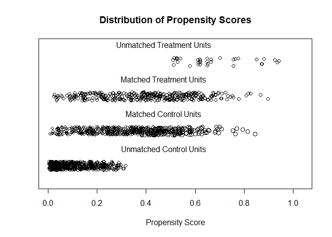

# Read data


```r
analytic.data <- readRDS("data/RHC.Rds")
baselinevars <- c("age","sex", "race","Disease.category", 
                  "Cancer", "DNR.status", "APACHE.III.score",
                  "Pr.2mo.survival","No.of.comorbidity",
                  "ADLs.2wk.prior","DASI.2wk.prior","Temperature",
                  "Heart.rate", "Blood.pressure","Respiratory.rate",
                  "WBC.count","PaO2.by.FIO2","PaCO2","pH",
                  "Creatinine","Albumin","GComa.Score")
```

# Propensity score (PS) analysis

## Table 1 (stratified by exposure)


```r
require(tableone)
tab1 <- CreateTableOne(vars = baselinevars,
               data = analytic.data, strata = "RHC", includeNA = TRUE, 
               test = FALSE, smd = TRUE)
tab1k <- kable(print(tab1, showAllLevels = TRUE, smd = TRUE)) %>%
  kable_styling(bootstrap_options = c("striped", "hover", "condensed", "responsive"), 
                full_width = FALSE)
```


```r
tab1k
```

<table class="table table-striped table-hover table-condensed table-responsive" style="width: auto !important; margin-left: auto; margin-right: auto;">
 <thead>
  <tr>
   <th style="text-align:left;">   </th>
   <th style="text-align:left;"> level </th>
   <th style="text-align:left;"> No RHC </th>
   <th style="text-align:left;"> RHC </th>
   <th style="text-align:left;"> SMD </th>
  </tr>
 </thead>
<tbody>
  <tr>
   <td style="text-align:left;"> n </td>
   <td style="text-align:left;">  </td>
   <td style="text-align:left;"> 1049 </td>
   <td style="text-align:left;"> 390 </td>
   <td style="text-align:left;">  </td>
  </tr>
  <tr>
   <td style="text-align:left;"> age (%) </td>
   <td style="text-align:left;"> [-Inf,50) </td>
   <td style="text-align:left;"> 264 (25.2) </td>
   <td style="text-align:left;"> 113 (29.0) </td>
   <td style="text-align:left;"> 0.288 </td>
  </tr>
  <tr>
   <td style="text-align:left;">  </td>
   <td style="text-align:left;"> [50,60) </td>
   <td style="text-align:left;"> 160 (15.3) </td>
   <td style="text-align:left;"> 85 (21.8) </td>
   <td style="text-align:left;">  </td>
  </tr>
  <tr>
   <td style="text-align:left;">  </td>
   <td style="text-align:left;"> [60,70) </td>
   <td style="text-align:left;"> 261 (24.9) </td>
   <td style="text-align:left;"> 99 (25.4) </td>
   <td style="text-align:left;">  </td>
  </tr>
  <tr>
   <td style="text-align:left;">  </td>
   <td style="text-align:left;"> [70,80) </td>
   <td style="text-align:left;"> 238 (22.7) </td>
   <td style="text-align:left;"> 70 (17.9) </td>
   <td style="text-align:left;">  </td>
  </tr>
  <tr>
   <td style="text-align:left;">  </td>
   <td style="text-align:left;"> [80, Inf) </td>
   <td style="text-align:left;"> 126 (12.0) </td>
   <td style="text-align:left;"> 23 ( 5.9) </td>
   <td style="text-align:left;">  </td>
  </tr>
  <tr>
   <td style="text-align:left;"> sex (%) </td>
   <td style="text-align:left;"> Male </td>
   <td style="text-align:left;"> 569 (54.2) </td>
   <td style="text-align:left;"> 253 (64.9) </td>
   <td style="text-align:left;"> 0.218 </td>
  </tr>
  <tr>
   <td style="text-align:left;">  </td>
   <td style="text-align:left;"> Female </td>
   <td style="text-align:left;"> 480 (45.8) </td>
   <td style="text-align:left;"> 137 (35.1) </td>
   <td style="text-align:left;">  </td>
  </tr>
  <tr>
   <td style="text-align:left;"> race (%) </td>
   <td style="text-align:left;"> white </td>
   <td style="text-align:left;"> 813 (77.5) </td>
   <td style="text-align:left;"> 297 (76.2) </td>
   <td style="text-align:left;"> 0.042 </td>
  </tr>
  <tr>
   <td style="text-align:left;">  </td>
   <td style="text-align:left;"> black </td>
   <td style="text-align:left;"> 176 (16.8) </td>
   <td style="text-align:left;"> 67 (17.2) </td>
   <td style="text-align:left;">  </td>
  </tr>
  <tr>
   <td style="text-align:left;">  </td>
   <td style="text-align:left;"> other </td>
   <td style="text-align:left;"> 60 ( 5.7) </td>
   <td style="text-align:left;"> 26 ( 6.7) </td>
   <td style="text-align:left;">  </td>
  </tr>
  <tr>
   <td style="text-align:left;"> Disease.category (%) </td>
   <td style="text-align:left;"> ARF </td>
   <td style="text-align:left;"> 429 (40.9) </td>
   <td style="text-align:left;"> 127 (32.6) </td>
   <td style="text-align:left;"> 0.682 </td>
  </tr>
  <tr>
   <td style="text-align:left;">  </td>
   <td style="text-align:left;"> CHF </td>
   <td style="text-align:left;"> 174 (16.6) </td>
   <td style="text-align:left;"> 129 (33.1) </td>
   <td style="text-align:left;">  </td>
  </tr>
  <tr>
   <td style="text-align:left;">  </td>
   <td style="text-align:left;"> MOSF </td>
   <td style="text-align:left;"> 180 (17.2) </td>
   <td style="text-align:left;"> 110 (28.2) </td>
   <td style="text-align:left;">  </td>
  </tr>
  <tr>
   <td style="text-align:left;">  </td>
   <td style="text-align:left;"> Other </td>
   <td style="text-align:left;"> 266 (25.4) </td>
   <td style="text-align:left;"> 24 ( 6.2) </td>
   <td style="text-align:left;">  </td>
  </tr>
  <tr>
   <td style="text-align:left;"> Cancer (%) </td>
   <td style="text-align:left;"> None </td>
   <td style="text-align:left;"> 797 (76.0) </td>
   <td style="text-align:left;"> 324 (83.1) </td>
   <td style="text-align:left;"> 0.178 </td>
  </tr>
  <tr>
   <td style="text-align:left;">  </td>
   <td style="text-align:left;"> Localized (Yes) </td>
   <td style="text-align:left;"> 171 (16.3) </td>
   <td style="text-align:left;"> 46 (11.8) </td>
   <td style="text-align:left;">  </td>
  </tr>
  <tr>
   <td style="text-align:left;">  </td>
   <td style="text-align:left;"> Metastatic </td>
   <td style="text-align:left;"> 81 ( 7.7) </td>
   <td style="text-align:left;"> 20 ( 5.1) </td>
   <td style="text-align:left;">  </td>
  </tr>
  <tr>
   <td style="text-align:left;"> DNR.status (%) </td>
   <td style="text-align:left;"> No </td>
   <td style="text-align:left;"> 962 (91.7) </td>
   <td style="text-align:left;"> 379 (97.2) </td>
   <td style="text-align:left;"> 0.241 </td>
  </tr>
  <tr>
   <td style="text-align:left;">  </td>
   <td style="text-align:left;"> Yes </td>
   <td style="text-align:left;"> 87 ( 8.3) </td>
   <td style="text-align:left;"> 11 ( 2.8) </td>
   <td style="text-align:left;">  </td>
  </tr>
  <tr>
   <td style="text-align:left;"> APACHE.III.score (mean (SD)) </td>
   <td style="text-align:left;">  </td>
   <td style="text-align:left;"> 48.36 (16.34) </td>
   <td style="text-align:left;"> 49.38 (19.71) </td>
   <td style="text-align:left;"> 0.057 </td>
  </tr>
  <tr>
   <td style="text-align:left;"> Pr.2mo.survival (mean (SD)) </td>
   <td style="text-align:left;">  </td>
   <td style="text-align:left;"> 0.70 (0.15) </td>
   <td style="text-align:left;"> 0.69 (0.17) </td>
   <td style="text-align:left;"> 0.079 </td>
  </tr>
  <tr>
   <td style="text-align:left;"> No.of.comorbidity (mean (SD)) </td>
   <td style="text-align:left;">  </td>
   <td style="text-align:left;"> 1.74 (1.22) </td>
   <td style="text-align:left;"> 1.76 (1.23) </td>
   <td style="text-align:left;"> 0.019 </td>
  </tr>
  <tr>
   <td style="text-align:left;"> ADLs.2wk.prior (mean (SD)) </td>
   <td style="text-align:left;">  </td>
   <td style="text-align:left;"> 1.24 (1.86) </td>
   <td style="text-align:left;"> 1.02 (1.69) </td>
   <td style="text-align:left;"> 0.129 </td>
  </tr>
  <tr>
   <td style="text-align:left;"> DASI.2wk.prior (mean (SD)) </td>
   <td style="text-align:left;">  </td>
   <td style="text-align:left;"> 20.36 (7.28) </td>
   <td style="text-align:left;"> 20.36 (6.96) </td>
   <td style="text-align:left;"> &lt;0.001 </td>
  </tr>
  <tr>
   <td style="text-align:left;"> Temperature (mean (SD)) </td>
   <td style="text-align:left;">  </td>
   <td style="text-align:left;"> 37.35 (1.66) </td>
   <td style="text-align:left;"> 37.24 (1.61) </td>
   <td style="text-align:left;"> 0.063 </td>
  </tr>
  <tr>
   <td style="text-align:left;"> Heart.rate (mean (SD)) </td>
   <td style="text-align:left;">  </td>
   <td style="text-align:left;"> 112.23 (38.20) </td>
   <td style="text-align:left;"> 108.66 (39.22) </td>
   <td style="text-align:left;"> 0.092 </td>
  </tr>
  <tr>
   <td style="text-align:left;"> Blood.pressure (mean (SD)) </td>
   <td style="text-align:left;">  </td>
   <td style="text-align:left;"> 87.35 (37.97) </td>
   <td style="text-align:left;"> 70.91 (33.38) </td>
   <td style="text-align:left;"> 0.460 </td>
  </tr>
  <tr>
   <td style="text-align:left;"> Respiratory.rate (mean (SD)) </td>
   <td style="text-align:left;">  </td>
   <td style="text-align:left;"> 30.43 (11.65) </td>
   <td style="text-align:left;"> 25.25 (12.73) </td>
   <td style="text-align:left;"> 0.424 </td>
  </tr>
  <tr>
   <td style="text-align:left;"> WBC.count (mean (SD)) </td>
   <td style="text-align:left;">  </td>
   <td style="text-align:left;"> 14.45 (11.16) </td>
   <td style="text-align:left;"> 14.75 (13.09) </td>
   <td style="text-align:left;"> 0.024 </td>
  </tr>
  <tr>
   <td style="text-align:left;"> PaO2.by.FIO2 (mean (SD)) </td>
   <td style="text-align:left;">  </td>
   <td style="text-align:left;"> 250.90 (112.53) </td>
   <td style="text-align:left;"> 238.90 (104.11) </td>
   <td style="text-align:left;"> 0.111 </td>
  </tr>
  <tr>
   <td style="text-align:left;"> PaCO2 (mean (SD)) </td>
   <td style="text-align:left;">  </td>
   <td style="text-align:left;"> 41.77 (14.86) </td>
   <td style="text-align:left;"> 37.16 (8.57) </td>
   <td style="text-align:left;"> 0.380 </td>
  </tr>
  <tr>
   <td style="text-align:left;"> pH (mean (SD)) </td>
   <td style="text-align:left;">  </td>
   <td style="text-align:left;"> 7.39 (0.10) </td>
   <td style="text-align:left;"> 7.40 (0.09) </td>
   <td style="text-align:left;"> 0.166 </td>
  </tr>
  <tr>
   <td style="text-align:left;"> Creatinine (mean (SD)) </td>
   <td style="text-align:left;">  </td>
   <td style="text-align:left;"> 2.03 (2.27) </td>
   <td style="text-align:left;"> 2.22 (2.05) </td>
   <td style="text-align:left;"> 0.084 </td>
  </tr>
  <tr>
   <td style="text-align:left;"> Albumin (mean (SD)) </td>
   <td style="text-align:left;">  </td>
   <td style="text-align:left;"> 3.26 (0.65) </td>
   <td style="text-align:left;"> 3.19 (0.64) </td>
   <td style="text-align:left;"> 0.108 </td>
  </tr>
  <tr>
   <td style="text-align:left;"> GComa.Score (mean (SD)) </td>
   <td style="text-align:left;">  </td>
   <td style="text-align:left;"> 5.25 (15.83) </td>
   <td style="text-align:left;"> 6.54 (17.20) </td>
   <td style="text-align:left;"> 0.078 </td>
  </tr>
</tbody>
</table>

## PS modelling


```r
ps.formula <- as.formula(I(RHC == "RHC") ~ age+sex+race+Disease.category+ 
                                Cancer+DNR.status+APACHE.III.score+
                                Pr.2mo.survival+No.of.comorbidity+
                                ADLs.2wk.prior+DASI.2wk.prior+Temperature+
                                Heart.rate+Blood.pressure+Respiratory.rate+
                                WBC.count+PaO2.by.FIO2+PaCO2+pH+
                                Creatinine+Albumin+GComa.Score)
# fit logistic regression
PS.fit <- glm(ps.formula,family="binomial", data=analytic.data)
# extract propensity scores
analytic.data$PS <- predict(PS.fit, newdata = analytic.data, type="response")
# summarize propensity scores
summary(analytic.data$PS)
```

```
##     Min.  1st Qu.   Median     Mean  3rd Qu.     Max. 
## 0.003351 0.097465 0.233698 0.271022 0.417233 0.941860
```

```r
# summarize propensity scores by exposure group
tapply(analytic.data$PS, analytic.data$RHC, summary)
```

```
## $`No RHC`
##     Min.  1st Qu.   Median     Mean  3rd Qu.     Max. 
## 0.003351 0.066781 0.176932 0.214205 0.321125 0.845037 
## 
## $RHC
##    Min. 1st Qu.  Median    Mean 3rd Qu.    Max. 
## 0.02451 0.26598 0.43403 0.42384 0.56963 0.94186
```

```r
# plot propensity scores by exposure group
plot(density(analytic.data$PS), col = "white", type = "n", main = "")
lines(density(analytic.data$PS[analytic.data$RHC == "RHC"]), 
     col = "red")
lines(density(analytic.data$PS[analytic.data$RHC == "No RHC"]), 
      col = "blue", lty = 2)
legend("topright", c("RHC","No RHC"), 
       col = c("red", "blue"), lty=1:2)
```

<!-- -->

# PS Matching 

We follow 4 steps as described in Austin 2011.

## Step 1
Specify the propensity score model to estimate propensity scores


```r
ps.formula <- as.formula(I(RHC == "RHC") ~ age+sex+race+Disease.category+ 
                                Cancer+DNR.status+APACHE.III.score+
                                Pr.2mo.survival+No.of.comorbidity+
                                ADLs.2wk.prior+DASI.2wk.prior+Temperature+
                                Heart.rate+Blood.pressure+Respiratory.rate+
                                WBC.count+PaO2.by.FIO2+PaCO2+pH+
                                Creatinine+Albumin+GComa.Score)
```

## Step 2


```r
require(MatchIt)
set.seed(123)
# This function fits propensity score model (using logistic 
# regression as above) when specified distance = 'logit'
# performs nearest-neighbor (NN) matching, 
# without replacement 
# with caliper = .2*SD of propensity score  
logitPS <-  -log(1/analytic.data$PS - 1) # calculate the logit of the propensity score
hist(logitPS)
```

<!-- -->

```r
# within which to draw control units 
# with 1:1 ratio (pair-matching)
match.obj <- matchit(ps.formula, data = analytic.data,
                     distance = 'logit', 
                     method = "nearest", 
                     replace=FALSE,
                     caliper = .2*sd(logitPS), 
                     ratio = 2)
# see matchit function options here
# https://www.rdocumentation.org/packages/MatchIt/versions/1.0-1/topics/matchit
analytic.data$PS <- match.obj$distance
summary(match.obj$distance)
```

```
##     Min.  1st Qu.   Median     Mean  3rd Qu.     Max. 
## 0.003351 0.097465 0.233698 0.271022 0.417233 0.941860
```

```r
plot(match.obj, type = "jitter")
```

<!-- -->

```
## [1] "To identify the units, use first mouse button; to stop, use second."
```

```
## integer(0)
```

```r
plot(match.obj, type = "hist")
```

<!-- -->


```r
tapply(analytic.data$PS, analytic.data$RHC, summary)
```

```
## $`No RHC`
##     Min.  1st Qu.   Median     Mean  3rd Qu.     Max. 
## 0.003351 0.066781 0.176932 0.214205 0.321125 0.845037 
## 
## $RHC
##    Min. 1st Qu.  Median    Mean 3rd Qu.    Max. 
## 0.02451 0.26598 0.43403 0.42384 0.56963 0.94186
```

```r
# check how many matched
match.obj
```

```
## 
## Call: 
## matchit(formula = ps.formula, data = analytic.data, method = "nearest", 
##     distance = "logit", replace = FALSE, caliper = 0.2 * sd(logitPS), 
##     ratio = 2)
## 
## Sample sizes:
##           Control Treated
## All          1049     390
## Matched       538     353
## Unmatched     511      37
## Discarded       0       0
```

```r
summary(match.obj, standardize = TRUE)
```

```
## 
## Call:
## matchit(formula = ps.formula, data = analytic.data, method = "nearest", 
##     distance = "logit", replace = FALSE, caliper = 0.2 * sd(logitPS), 
##     ratio = 2)
## 
## Summary of balance for all data:
##                       Means Treated Means Control SD Control Std. Mean Diff.
## distance                     0.4238        0.2142     0.1707          1.0478
## age[-Inf,50)                 0.2897        0.2517     0.4342          0.0838
## age[50,60)                   0.2179        0.1525     0.3597          0.1583
## age[60,70)                   0.2538        0.2488     0.4325          0.0116
## age[70,80)                   0.1795        0.2269     0.4190         -0.1233
## age[80, Inf)                 0.0590        0.1201     0.3253         -0.2592
## sexFemale                    0.3513        0.4576     0.4984         -0.2224
## raceblack                    0.1718        0.1678     0.3738          0.0106
## raceother                    0.0667        0.0572     0.2323          0.0379
## Disease.categoryCHF          0.3308        0.1659     0.3721          0.3500
## Disease.categoryMOSF         0.2821        0.1716     0.3772          0.2452
## Disease.categoryOther        0.0615        0.2536     0.4353         -0.7981
## CancerLocalized (Yes)        0.1179        0.1630     0.3696         -0.1395
## CancerMetastatic             0.0513        0.0772     0.2671         -0.1174
## DNR.statusYes                0.0282        0.0829     0.2759         -0.3302
## APACHE.III.score            49.3821       48.3565    16.3353          0.0520
## Pr.2mo.survival              0.6870        0.6998     0.1495         -0.0743
## No.of.comorbidity            1.7641        1.7407     1.2152          0.0191
## ADLs.2wk.prior               1.0154        1.2440     1.8605         -0.1350
## DASI.2wk.prior              20.3577       20.3590     7.2795         -0.0002
## Temperature                 37.2431       37.3466     1.6635         -0.0642
## Heart.rate                 108.6564      112.2326    38.2003         -0.0912
## Blood.pressure              70.9128       87.3546    37.9652         -0.4926
## Respiratory.rate            25.2538       30.4337    11.6512         -0.4069
## WBC.count                   14.7524       14.4546    11.1580          0.0227
## PaO2.by.FIO2               238.8988      250.8964   112.5266         -0.1152
## PaCO2                       37.1561       41.7678    14.8597         -0.5380
## pH                           7.4005        7.3852     0.0987          0.1800
## Creatinine                   2.2150        2.0333     2.2680          0.0889
## Albumin                      3.1863        3.2556     0.6465         -0.1089
## GComa.Score                  6.5410        5.2459    15.8311          0.0753
##                       eCDF Med eCDF Mean eCDF Max
## distance                0.3243    0.2874   0.4402
## age[-Inf,50)            0.0190    0.0190   0.0381
## age[50,60)              0.0327    0.0327   0.0654
## age[60,70)              0.0025    0.0025   0.0050
## age[70,80)              0.0237    0.0237   0.0474
## age[80, Inf)            0.0306    0.0306   0.0611
## sexFemale               0.0531    0.0531   0.1063
## raceblack               0.0020    0.0020   0.0040
## raceother               0.0047    0.0047   0.0095
## Disease.categoryCHF     0.0824    0.0824   0.1649
## Disease.categoryMOSF    0.0552    0.0552   0.1105
## Disease.categoryOther   0.0960    0.0960   0.1920
## CancerLocalized (Yes)   0.0225    0.0225   0.0451
## CancerMetastatic        0.0130    0.0130   0.0259
## DNR.statusYes           0.0274    0.0274   0.0547
## APACHE.III.score        0.0282    0.0307   0.0709
## Pr.2mo.survival         0.0298    0.0265   0.0525
## No.of.comorbidity       0.0109    0.0099   0.0258
## ADLs.2wk.prior          0.0278    0.0286   0.0673
## DASI.2wk.prior          0.0178    0.0176   0.0449
## Temperature             0.0115    0.0134   0.0338
## Heart.rate              0.0138    0.0186   0.0737
## Blood.pressure          0.0850    0.1044   0.2301
## Respiratory.rate        0.0710    0.0847   0.2303
## WBC.count               0.0105    0.0134   0.0471
## PaO2.by.FIO2            0.0292    0.0287   0.0712
## PaCO2                   0.0465    0.0571   0.1680
## pH                      0.0243    0.0248   0.0942
## Creatinine              0.0065    0.0233   0.1478
## Albumin                 0.0161    0.0250   0.1271
## GComa.Score             0.0016    0.0089   0.0453
## 
## 
## Summary of balance for matched data:
##                       Means Treated Means Control SD Control Std. Mean Diff.
## distance                     0.3978        0.3666     0.1723          0.1559
## age[-Inf,50)                 0.3059        0.2677     0.4432          0.0842
## age[50,60)                   0.1926        0.1997     0.4002         -0.0171
## age[60,70)                   0.2521        0.2620     0.4402         -0.0228
## age[70,80)                   0.1898        0.1997     0.4002         -0.0258
## age[80, Inf)                 0.0595        0.0708     0.2568         -0.0480
## sexFemale                    0.3654        0.3966     0.4896         -0.0652
## raceblack                    0.1728        0.1742     0.3797         -0.0038
## raceother                    0.0680        0.0538     0.2259          0.0567
## Disease.categoryCHF          0.3229        0.3102     0.4630          0.0271
## Disease.categoryMOSF         0.2776        0.2649     0.4417          0.0283
## Disease.categoryOther        0.0680        0.0779     0.2683         -0.0412
## CancerLocalized (Yes)        0.1190        0.1261     0.3322         -0.0219
## CancerMetastatic             0.0567        0.0439     0.2051          0.0577
## DNR.statusYes                0.0312        0.0368     0.1885         -0.0342
## APACHE.III.score            49.2153       49.5878    18.6140         -0.0189
## Pr.2mo.survival              0.6933        0.6951     0.1654         -0.0103
## No.of.comorbidity            1.7394        1.8017     1.2776         -0.0508
## ADLs.2wk.prior               1.0142        1.1218     1.7891         -0.0636
## DASI.2wk.prior              20.5481       20.4828     7.1653          0.0094
## Temperature                 37.2303       37.2506     1.7529         -0.0126
## Heart.rate                 109.3513      110.2578    40.0272         -0.0231
## Blood.pressure              73.1246       75.8258    34.4996         -0.0809
## Respiratory.rate            26.3003       27.1955    11.7686         -0.0703
## WBC.count                   14.8069       14.9710    12.7852         -0.0125
## PaO2.by.FIO2               240.8011      238.6246    99.3934          0.0209
## PaCO2                       37.0761       37.8998    10.0324         -0.0961
## pH                           7.4007        7.3967     0.0882          0.0468
## Creatinine                   2.2450        2.3535     2.6148         -0.0531
## Albumin                      3.1835        3.1885     0.6697         -0.0080
## GComa.Score                  6.2890        6.6856    18.8236         -0.0231
##                       eCDF Med eCDF Mean eCDF Max
## distance                0.1292    0.1215   0.2276
## age[-Inf,50)            0.0201    0.0201   0.0401
## age[50,60)              0.0043    0.0043   0.0086
## age[60,70)              0.0031    0.0031   0.0062
## age[70,80)              0.0083    0.0083   0.0165
## age[80, Inf)            0.0130    0.0130   0.0260
## sexFemale               0.0292    0.0292   0.0584
## raceblack               0.0019    0.0019   0.0038
## raceother               0.0089    0.0089   0.0178
## Disease.categoryCHF     0.0249    0.0249   0.0497
## Disease.categoryMOSF    0.0180    0.0180   0.0360
## Disease.categoryOther   0.0162    0.0162   0.0324
## CancerLocalized (Yes)   0.0074    0.0074   0.0148
## CancerMetastatic        0.0042    0.0042   0.0083
## DNR.statusYes           0.0067    0.0067   0.0134
## APACHE.III.score        0.0181    0.0204   0.0577
## Pr.2mo.survival         0.0183    0.0183   0.0465
## No.of.comorbidity       0.0080    0.0121   0.0333
## ADLs.2wk.prior          0.0156    0.0168   0.0373
## DASI.2wk.prior          0.0100    0.0135   0.0423
## Temperature             0.0120    0.0168   0.0511
## Heart.rate              0.0103    0.0128   0.0466
## Blood.pressure          0.0273    0.0403   0.1093
## Respiratory.rate        0.0127    0.0393   0.1279
## WBC.count               0.0124    0.0141   0.0425
## PaO2.by.FIO2            0.0177    0.0203   0.0546
## PaCO2                   0.0107    0.0146   0.0677
## pH                      0.0074    0.0089   0.0391
## Creatinine              0.0156    0.0215   0.1129
## Albumin                 0.0086    0.0220   0.0917
## GComa.Score             0.0062    0.0088   0.0309
## 
## Percent Balance Improvement:
##                       Std. Mean Diff.  eCDF Med eCDF Mean eCDF Max
## distance                      85.1245   60.1739   57.7181  48.3029
## age[-Inf,50)                  -0.4420   -5.4482   -5.4482  -5.4482
## age[50,60)                    89.1747   86.8246   86.8246  86.8246
## age[60,70)                   -96.8138  -23.8578  -23.8578 -23.8578
## age[70,80)                    79.0803   65.1486   65.1486  65.1486
## age[80, Inf)                  81.4664   57.4554   57.4554  57.4554
## sexFemale                     70.6844   45.1039   45.1039  45.1039
## raceblack                     64.7306    5.9920    5.9920   5.9920
## raceother                    -49.5808  -88.0047  -88.0047 -88.0047
## Disease.categoryCHF           92.2692   69.8527   69.8527  69.8527
## Disease.categoryMOSF          88.4592   67.4227   67.4227  67.4227
## Disease.categoryOther         94.8369   83.1370   83.1370  83.1370
## CancerLocalized (Yes)         84.2841   67.0492   67.0492  67.0492
## CancerMetastatic              50.8456   67.8801   67.8801  67.8801
## DNR.statusYes                 89.6481   75.4286   75.4286  75.4286
## APACHE.III.score              63.6749   35.9256   33.6548  18.5878
## Pr.2mo.survival               86.1459   38.4240   31.0377  11.4198
## No.of.comorbidity           -166.3700   27.1187  -21.7178 -29.2185
## ADLs.2wk.prior                52.9214   43.6547   41.1632  44.6402
## DASI.2wk.prior             -4729.5244   43.6144   23.2343   5.7764
## Temperature                   80.4504   -4.6868  -25.5732 -51.1261
## Heart.rate                    74.6514   25.5120   31.1245  36.8202
## Blood.pressure                83.5716   67.8322   61.3837  52.5023
## Respiratory.rate              82.7181   82.1807   53.6463  44.4525
## WBC.count                     44.9062  -17.4011   -4.5981   9.7949
## PaO2.by.FIO2                  81.8588   39.5251   29.3010  23.3182
## PaCO2                         82.1406   77.0365   74.3582  59.7240
## pH                            74.0232   69.7298   64.0146  58.5351
## Creatinine                    40.2649 -141.0927    7.5939  23.5859
## Albumin                       92.6944   46.5346   12.0100  27.8541
## GComa.Score                   69.3763 -292.7631    1.2321  31.8099
## 
## Sample sizes:
##           Control Treated
## All          1049     390
## Matched       538     353
## Unmatched     511      37
## Discarded       0       0
```

```r
# extract matched data
matched.data <- match.data(match.obj)
```

## Step 3

Compare the similarity of baseline characteristics between treated and untreated subjects in a the propensity score-matched sample. In this case, we will compare SMD < 0.1 or not


```r
tab1m <- CreateTableOne(vars = baselinevars,
               data = matched.data, strata = "RHC", includeNA = TRUE, 
               test = FALSE, smd = TRUE)
tab1mk <- kable(print(tab1m, showAllLevels = TRUE, smd = TRUE)) %>%
  kable_styling(bootstrap_options = c("striped", "hover", "condensed", "responsive"), 
                full_width = FALSE)
```


```r
tab1mk
```

<table class="table table-striped table-hover table-condensed table-responsive" style="width: auto !important; margin-left: auto; margin-right: auto;">
 <thead>
  <tr>
   <th style="text-align:left;">   </th>
   <th style="text-align:left;"> level </th>
   <th style="text-align:left;"> No RHC </th>
   <th style="text-align:left;"> RHC </th>
   <th style="text-align:left;"> SMD </th>
  </tr>
 </thead>
<tbody>
  <tr>
   <td style="text-align:left;"> n </td>
   <td style="text-align:left;">  </td>
   <td style="text-align:left;"> 538 </td>
   <td style="text-align:left;"> 353 </td>
   <td style="text-align:left;">  </td>
  </tr>
  <tr>
   <td style="text-align:left;"> age (%) </td>
   <td style="text-align:left;"> [-Inf,50) </td>
   <td style="text-align:left;"> 143 (26.6) </td>
   <td style="text-align:left;"> 108 (30.6) </td>
   <td style="text-align:left;"> 0.130 </td>
  </tr>
  <tr>
   <td style="text-align:left;">  </td>
   <td style="text-align:left;"> [50,60) </td>
   <td style="text-align:left;"> 99 (18.4) </td>
   <td style="text-align:left;"> 68 (19.3) </td>
   <td style="text-align:left;">  </td>
  </tr>
  <tr>
   <td style="text-align:left;">  </td>
   <td style="text-align:left;"> [60,70) </td>
   <td style="text-align:left;"> 139 (25.8) </td>
   <td style="text-align:left;"> 89 (25.2) </td>
   <td style="text-align:left;">  </td>
  </tr>
  <tr>
   <td style="text-align:left;">  </td>
   <td style="text-align:left;"> [70,80) </td>
   <td style="text-align:left;"> 111 (20.6) </td>
   <td style="text-align:left;"> 67 (19.0) </td>
   <td style="text-align:left;">  </td>
  </tr>
  <tr>
   <td style="text-align:left;">  </td>
   <td style="text-align:left;"> [80, Inf) </td>
   <td style="text-align:left;"> 46 ( 8.6) </td>
   <td style="text-align:left;"> 21 ( 5.9) </td>
   <td style="text-align:left;">  </td>
  </tr>
  <tr>
   <td style="text-align:left;"> sex (%) </td>
   <td style="text-align:left;"> Male </td>
   <td style="text-align:left;"> 310 (57.6) </td>
   <td style="text-align:left;"> 224 (63.5) </td>
   <td style="text-align:left;"> 0.120 </td>
  </tr>
  <tr>
   <td style="text-align:left;">  </td>
   <td style="text-align:left;"> Female </td>
   <td style="text-align:left;"> 228 (42.4) </td>
   <td style="text-align:left;"> 129 (36.5) </td>
   <td style="text-align:left;">  </td>
  </tr>
  <tr>
   <td style="text-align:left;"> race (%) </td>
   <td style="text-align:left;"> white </td>
   <td style="text-align:left;"> 416 (77.3) </td>
   <td style="text-align:left;"> 268 (75.9) </td>
   <td style="text-align:left;"> 0.076 </td>
  </tr>
  <tr>
   <td style="text-align:left;">  </td>
   <td style="text-align:left;"> black </td>
   <td style="text-align:left;"> 95 (17.7) </td>
   <td style="text-align:left;"> 61 (17.3) </td>
   <td style="text-align:left;">  </td>
  </tr>
  <tr>
   <td style="text-align:left;">  </td>
   <td style="text-align:left;"> other </td>
   <td style="text-align:left;"> 27 ( 5.0) </td>
   <td style="text-align:left;"> 24 ( 6.8) </td>
   <td style="text-align:left;">  </td>
  </tr>
  <tr>
   <td style="text-align:left;"> Disease.category (%) </td>
   <td style="text-align:left;"> ARF </td>
   <td style="text-align:left;"> 207 (38.5) </td>
   <td style="text-align:left;"> 117 (33.1) </td>
   <td style="text-align:left;"> 0.184 </td>
  </tr>
  <tr>
   <td style="text-align:left;">  </td>
   <td style="text-align:left;"> CHF </td>
   <td style="text-align:left;"> 147 (27.3) </td>
   <td style="text-align:left;"> 114 (32.3) </td>
   <td style="text-align:left;">  </td>
  </tr>
  <tr>
   <td style="text-align:left;">  </td>
   <td style="text-align:left;"> MOSF </td>
   <td style="text-align:left;"> 130 (24.2) </td>
   <td style="text-align:left;"> 98 (27.8) </td>
   <td style="text-align:left;">  </td>
  </tr>
  <tr>
   <td style="text-align:left;">  </td>
   <td style="text-align:left;"> Other </td>
   <td style="text-align:left;"> 54 (10.0) </td>
   <td style="text-align:left;"> 24 ( 6.8) </td>
   <td style="text-align:left;">  </td>
  </tr>
  <tr>
   <td style="text-align:left;"> Cancer (%) </td>
   <td style="text-align:left;"> None </td>
   <td style="text-align:left;"> 440 (81.8) </td>
   <td style="text-align:left;"> 291 (82.4) </td>
   <td style="text-align:left;"> 0.056 </td>
  </tr>
  <tr>
   <td style="text-align:left;">  </td>
   <td style="text-align:left;"> Localized (Yes) </td>
   <td style="text-align:left;"> 72 (13.4) </td>
   <td style="text-align:left;"> 42 (11.9) </td>
   <td style="text-align:left;">  </td>
  </tr>
  <tr>
   <td style="text-align:left;">  </td>
   <td style="text-align:left;"> Metastatic </td>
   <td style="text-align:left;"> 26 ( 4.8) </td>
   <td style="text-align:left;"> 20 ( 5.7) </td>
   <td style="text-align:left;">  </td>
  </tr>
  <tr>
   <td style="text-align:left;"> DNR.status (%) </td>
   <td style="text-align:left;"> No </td>
   <td style="text-align:left;"> 514 (95.5) </td>
   <td style="text-align:left;"> 342 (96.9) </td>
   <td style="text-align:left;"> 0.070 </td>
  </tr>
  <tr>
   <td style="text-align:left;">  </td>
   <td style="text-align:left;"> Yes </td>
   <td style="text-align:left;"> 24 ( 4.5) </td>
   <td style="text-align:left;"> 11 ( 3.1) </td>
   <td style="text-align:left;">  </td>
  </tr>
  <tr>
   <td style="text-align:left;"> APACHE.III.score (mean (SD)) </td>
   <td style="text-align:left;">  </td>
   <td style="text-align:left;"> 49.20 (17.73) </td>
   <td style="text-align:left;"> 49.22 (19.52) </td>
   <td style="text-align:left;"> 0.001 </td>
  </tr>
  <tr>
   <td style="text-align:left;"> Pr.2mo.survival (mean (SD)) </td>
   <td style="text-align:left;">  </td>
   <td style="text-align:left;"> 0.70 (0.16) </td>
   <td style="text-align:left;"> 0.69 (0.16) </td>
   <td style="text-align:left;"> 0.021 </td>
  </tr>
  <tr>
   <td style="text-align:left;"> No.of.comorbidity (mean (SD)) </td>
   <td style="text-align:left;">  </td>
   <td style="text-align:left;"> 1.77 (1.27) </td>
   <td style="text-align:left;"> 1.74 (1.25) </td>
   <td style="text-align:left;"> 0.025 </td>
  </tr>
  <tr>
   <td style="text-align:left;"> ADLs.2wk.prior (mean (SD)) </td>
   <td style="text-align:left;">  </td>
   <td style="text-align:left;"> 1.15 (1.80) </td>
   <td style="text-align:left;"> 1.01 (1.71) </td>
   <td style="text-align:left;"> 0.077 </td>
  </tr>
  <tr>
   <td style="text-align:left;"> DASI.2wk.prior (mean (SD)) </td>
   <td style="text-align:left;">  </td>
   <td style="text-align:left;"> 20.47 (7.21) </td>
   <td style="text-align:left;"> 20.55 (7.00) </td>
   <td style="text-align:left;"> 0.011 </td>
  </tr>
  <tr>
   <td style="text-align:left;"> Temperature (mean (SD)) </td>
   <td style="text-align:left;">  </td>
   <td style="text-align:left;"> 37.33 (1.71) </td>
   <td style="text-align:left;"> 37.23 (1.59) </td>
   <td style="text-align:left;"> 0.060 </td>
  </tr>
  <tr>
   <td style="text-align:left;"> Heart.rate (mean (SD)) </td>
   <td style="text-align:left;">  </td>
   <td style="text-align:left;"> 110.21 (39.50) </td>
   <td style="text-align:left;"> 109.35 (37.98) </td>
   <td style="text-align:left;"> 0.022 </td>
  </tr>
  <tr>
   <td style="text-align:left;"> Blood.pressure (mean (SD)) </td>
   <td style="text-align:left;">  </td>
   <td style="text-align:left;"> 79.04 (35.86) </td>
   <td style="text-align:left;"> 73.12 (33.48) </td>
   <td style="text-align:left;"> 0.170 </td>
  </tr>
  <tr>
   <td style="text-align:left;"> Respiratory.rate (mean (SD)) </td>
   <td style="text-align:left;">  </td>
   <td style="text-align:left;"> 28.25 (11.68) </td>
   <td style="text-align:left;"> 26.30 (12.50) </td>
   <td style="text-align:left;"> 0.161 </td>
  </tr>
  <tr>
   <td style="text-align:left;"> WBC.count (mean (SD)) </td>
   <td style="text-align:left;">  </td>
   <td style="text-align:left;"> 14.87 (12.03) </td>
   <td style="text-align:left;"> 14.81 (13.46) </td>
   <td style="text-align:left;"> 0.005 </td>
  </tr>
  <tr>
   <td style="text-align:left;"> PaO2.by.FIO2 (mean (SD)) </td>
   <td style="text-align:left;">  </td>
   <td style="text-align:left;"> 240.14 (99.53) </td>
   <td style="text-align:left;"> 240.80 (104.74) </td>
   <td style="text-align:left;"> 0.006 </td>
  </tr>
  <tr>
   <td style="text-align:left;"> PaCO2 (mean (SD)) </td>
   <td style="text-align:left;">  </td>
   <td style="text-align:left;"> 38.14 (10.51) </td>
   <td style="text-align:left;"> 37.08 (8.61) </td>
   <td style="text-align:left;"> 0.111 </td>
  </tr>
  <tr>
   <td style="text-align:left;"> pH (mean (SD)) </td>
   <td style="text-align:left;">  </td>
   <td style="text-align:left;"> 7.40 (0.09) </td>
   <td style="text-align:left;"> 7.40 (0.08) </td>
   <td style="text-align:left;"> 0.034 </td>
  </tr>
  <tr>
   <td style="text-align:left;"> Creatinine (mean (SD)) </td>
   <td style="text-align:left;">  </td>
   <td style="text-align:left;"> 2.30 (2.56) </td>
   <td style="text-align:left;"> 2.24 (2.10) </td>
   <td style="text-align:left;"> 0.026 </td>
  </tr>
  <tr>
   <td style="text-align:left;"> Albumin (mean (SD)) </td>
   <td style="text-align:left;">  </td>
   <td style="text-align:left;"> 3.20 (0.66) </td>
   <td style="text-align:left;"> 3.18 (0.64) </td>
   <td style="text-align:left;"> 0.020 </td>
  </tr>
  <tr>
   <td style="text-align:left;"> GComa.Score (mean (SD)) </td>
   <td style="text-align:left;">  </td>
   <td style="text-align:left;"> 6.09 (17.45) </td>
   <td style="text-align:left;"> 6.29 (16.44) </td>
   <td style="text-align:left;"> 0.012 </td>
  </tr>
</tbody>
</table>


## Step 4

Estimate the effect of treatment on outcomes using propensity score-matched sample


```r
fit3 <- glm(I(Death=="Yes")~RHC,
            family=binomial, data = matched.data)
summ(fit3, exp = TRUE)
```

<table class="table table-striped table-hover table-condensed table-responsive" style="width: auto !important; margin-left: auto; margin-right: auto;">
<tbody>
  <tr>
   <td style="text-align:left;font-weight: bold;"> Observations </td>
   <td style="text-align:right;"> 891 </td>
  </tr>
  <tr>
   <td style="text-align:left;font-weight: bold;"> Dependent variable </td>
   <td style="text-align:right;"> I(Death == "Yes") </td>
  </tr>
  <tr>
   <td style="text-align:left;font-weight: bold;"> Type </td>
   <td style="text-align:right;"> Generalized linear model </td>
  </tr>
  <tr>
   <td style="text-align:left;font-weight: bold;"> Family </td>
   <td style="text-align:right;"> binomial </td>
  </tr>
  <tr>
   <td style="text-align:left;font-weight: bold;"> Link </td>
   <td style="text-align:right;"> logit </td>
  </tr>
</tbody>
</table> <table class="table table-striped table-hover table-condensed table-responsive" style="width: auto !important; margin-left: auto; margin-right: auto;">
<tbody>
  <tr>
   <td style="text-align:left;font-weight: bold;"> χ²(1) </td>
   <td style="text-align:right;"> 0.60 </td>
  </tr>
  <tr>
   <td style="text-align:left;font-weight: bold;"> Pseudo-R² (Cragg-Uhler) </td>
   <td style="text-align:right;"> 0.00 </td>
  </tr>
  <tr>
   <td style="text-align:left;font-weight: bold;"> Pseudo-R² (McFadden) </td>
   <td style="text-align:right;"> 0.00 </td>
  </tr>
  <tr>
   <td style="text-align:left;font-weight: bold;"> AIC </td>
   <td style="text-align:right;"> 1237.51 </td>
  </tr>
  <tr>
   <td style="text-align:left;font-weight: bold;"> BIC </td>
   <td style="text-align:right;"> 1247.10 </td>
  </tr>
</tbody>
</table> <table class="table table-striped table-hover table-condensed table-responsive" style="width: auto !important; margin-left: auto; margin-right: auto;">
 <thead>
  <tr>
   <th style="text-align:left;">   </th>
   <th style="text-align:right;"> exp(Est.) </th>
   <th style="text-align:right;"> 2.5% </th>
   <th style="text-align:right;"> 97.5% </th>
   <th style="text-align:right;"> z val. </th>
   <th style="text-align:right;"> p </th>
  </tr>
 </thead>
<tbody>
  <tr>
   <td style="text-align:left;font-weight: bold;"> (Intercept) </td>
   <td style="text-align:right;"> 0.89 </td>
   <td style="text-align:right;"> 0.76 </td>
   <td style="text-align:right;"> 1.06 </td>
   <td style="text-align:right;"> -1.29 </td>
   <td style="text-align:right;"> 0.20 </td>
  </tr>
  <tr>
   <td style="text-align:left;font-weight: bold;"> RHCRHC </td>
   <td style="text-align:right;"> 1.11 </td>
   <td style="text-align:right;"> 0.85 </td>
   <td style="text-align:right;"> 1.45 </td>
   <td style="text-align:right;"> 0.77 </td>
   <td style="text-align:right;"> 0.44 </td>
  </tr>
</tbody>
<tfoot><tr><td style="padding: 0; border: 0;" colspan="100%">
<sup></sup> Standard errors: MLE</td></tr></tfoot>
</table>

```r
publish(fit3)
```

```
##  Variable  Units OddsRatio       CI.95  p-value 
##       RHC No RHC       Ref                      
##              RHC      1.11 [0.85;1.45]   0.4395
```

General idea is that if any SMD >= 0.1, go back to the modelling stage, and change the PS model specification. If all else fails, adjust for the variables that are indicating some residual imbalance.


```r
fit4 <- glm(I(Death=="Yes")~RHC+age+sex+Disease.category+
              Blood.pressure+Respiratory.rate+PaCO2,
            family=binomial, data = matched.data)
summ(fit4, exp = TRUE)
```

<table class="table table-striped table-hover table-condensed table-responsive" style="width: auto !important; margin-left: auto; margin-right: auto;">
<tbody>
  <tr>
   <td style="text-align:left;font-weight: bold;"> Observations </td>
   <td style="text-align:right;"> 891 </td>
  </tr>
  <tr>
   <td style="text-align:left;font-weight: bold;"> Dependent variable </td>
   <td style="text-align:right;"> I(Death == "Yes") </td>
  </tr>
  <tr>
   <td style="text-align:left;font-weight: bold;"> Type </td>
   <td style="text-align:right;"> Generalized linear model </td>
  </tr>
  <tr>
   <td style="text-align:left;font-weight: bold;"> Family </td>
   <td style="text-align:right;"> binomial </td>
  </tr>
  <tr>
   <td style="text-align:left;font-weight: bold;"> Link </td>
   <td style="text-align:right;"> logit </td>
  </tr>
</tbody>
</table> <table class="table table-striped table-hover table-condensed table-responsive" style="width: auto !important; margin-left: auto; margin-right: auto;">
<tbody>
  <tr>
   <td style="text-align:left;font-weight: bold;"> χ²(12) </td>
   <td style="text-align:right;"> 70.61 </td>
  </tr>
  <tr>
   <td style="text-align:left;font-weight: bold;"> Pseudo-R² (Cragg-Uhler) </td>
   <td style="text-align:right;"> 0.10 </td>
  </tr>
  <tr>
   <td style="text-align:left;font-weight: bold;"> Pseudo-R² (McFadden) </td>
   <td style="text-align:right;"> 0.06 </td>
  </tr>
  <tr>
   <td style="text-align:left;font-weight: bold;"> AIC </td>
   <td style="text-align:right;"> 1189.50 </td>
  </tr>
  <tr>
   <td style="text-align:left;font-weight: bold;"> BIC </td>
   <td style="text-align:right;"> 1251.80 </td>
  </tr>
</tbody>
</table> <table class="table table-striped table-hover table-condensed table-responsive" style="width: auto !important; margin-left: auto; margin-right: auto;">
 <thead>
  <tr>
   <th style="text-align:left;">   </th>
   <th style="text-align:right;"> exp(Est.) </th>
   <th style="text-align:right;"> 2.5% </th>
   <th style="text-align:right;"> 97.5% </th>
   <th style="text-align:right;"> z val. </th>
   <th style="text-align:right;"> p </th>
  </tr>
 </thead>
<tbody>
  <tr>
   <td style="text-align:left;font-weight: bold;"> (Intercept) </td>
   <td style="text-align:right;"> 0.73 </td>
   <td style="text-align:right;"> 0.33 </td>
   <td style="text-align:right;"> 1.61 </td>
   <td style="text-align:right;"> -0.79 </td>
   <td style="text-align:right;"> 0.43 </td>
  </tr>
  <tr>
   <td style="text-align:left;font-weight: bold;"> RHCRHC </td>
   <td style="text-align:right;"> 1.07 </td>
   <td style="text-align:right;"> 0.80 </td>
   <td style="text-align:right;"> 1.42 </td>
   <td style="text-align:right;"> 0.45 </td>
   <td style="text-align:right;"> 0.65 </td>
  </tr>
  <tr>
   <td style="text-align:left;font-weight: bold;"> age[50,60) </td>
   <td style="text-align:right;"> 2.04 </td>
   <td style="text-align:right;"> 1.35 </td>
   <td style="text-align:right;"> 3.08 </td>
   <td style="text-align:right;"> 3.37 </td>
   <td style="text-align:right;"> 0.00 </td>
  </tr>
  <tr>
   <td style="text-align:left;font-weight: bold;"> age[60,70) </td>
   <td style="text-align:right;"> 2.20 </td>
   <td style="text-align:right;"> 1.50 </td>
   <td style="text-align:right;"> 3.23 </td>
   <td style="text-align:right;"> 4.04 </td>
   <td style="text-align:right;"> 0.00 </td>
  </tr>
  <tr>
   <td style="text-align:left;font-weight: bold;"> age[70,80) </td>
   <td style="text-align:right;"> 2.38 </td>
   <td style="text-align:right;"> 1.58 </td>
   <td style="text-align:right;"> 3.60 </td>
   <td style="text-align:right;"> 4.13 </td>
   <td style="text-align:right;"> 0.00 </td>
  </tr>
  <tr>
   <td style="text-align:left;font-weight: bold;"> age[80, Inf) </td>
   <td style="text-align:right;"> 3.54 </td>
   <td style="text-align:right;"> 1.98 </td>
   <td style="text-align:right;"> 6.33 </td>
   <td style="text-align:right;"> 4.25 </td>
   <td style="text-align:right;"> 0.00 </td>
  </tr>
  <tr>
   <td style="text-align:left;font-weight: bold;"> sexFemale </td>
   <td style="text-align:right;"> 0.66 </td>
   <td style="text-align:right;"> 0.49 </td>
   <td style="text-align:right;"> 0.87 </td>
   <td style="text-align:right;"> -2.88 </td>
   <td style="text-align:right;"> 0.00 </td>
  </tr>
  <tr>
   <td style="text-align:left;font-weight: bold;"> Disease.categoryCHF </td>
   <td style="text-align:right;"> 2.07 </td>
   <td style="text-align:right;"> 1.46 </td>
   <td style="text-align:right;"> 2.93 </td>
   <td style="text-align:right;"> 4.12 </td>
   <td style="text-align:right;"> 0.00 </td>
  </tr>
  <tr>
   <td style="text-align:left;font-weight: bold;"> Disease.categoryMOSF </td>
   <td style="text-align:right;"> 2.09 </td>
   <td style="text-align:right;"> 1.45 </td>
   <td style="text-align:right;"> 3.00 </td>
   <td style="text-align:right;"> 3.98 </td>
   <td style="text-align:right;"> 0.00 </td>
  </tr>
  <tr>
   <td style="text-align:left;font-weight: bold;"> Disease.categoryOther </td>
   <td style="text-align:right;"> 2.28 </td>
   <td style="text-align:right;"> 1.33 </td>
   <td style="text-align:right;"> 3.90 </td>
   <td style="text-align:right;"> 3.01 </td>
   <td style="text-align:right;"> 0.00 </td>
  </tr>
  <tr>
   <td style="text-align:left;font-weight: bold;"> Blood.pressure </td>
   <td style="text-align:right;"> 1.00 </td>
   <td style="text-align:right;"> 0.99 </td>
   <td style="text-align:right;"> 1.00 </td>
   <td style="text-align:right;"> -2.04 </td>
   <td style="text-align:right;"> 0.04 </td>
  </tr>
  <tr>
   <td style="text-align:left;font-weight: bold;"> Respiratory.rate </td>
   <td style="text-align:right;"> 1.00 </td>
   <td style="text-align:right;"> 0.99 </td>
   <td style="text-align:right;"> 1.01 </td>
   <td style="text-align:right;"> 0.30 </td>
   <td style="text-align:right;"> 0.76 </td>
  </tr>
  <tr>
   <td style="text-align:left;font-weight: bold;"> PaCO2 </td>
   <td style="text-align:right;"> 0.99 </td>
   <td style="text-align:right;"> 0.97 </td>
   <td style="text-align:right;"> 1.00 </td>
   <td style="text-align:right;"> -1.49 </td>
   <td style="text-align:right;"> 0.14 </td>
  </tr>
</tbody>
<tfoot><tr><td style="padding: 0; border: 0;" colspan="100%">
<sup></sup> Standard errors: MLE</td></tr></tfoot>
</table>

```r
publish(fit4)
```

```
##          Variable     Units OddsRatio       CI.95     p-value 
##               RHC    No RHC       Ref                         
##                         RHC      1.07 [0.80;1.42]   0.6504092 
##               age [-Inf,50)       Ref                         
##                     [50,60)      2.04 [1.35;3.08]   0.0007404 
##                     [60,70)      2.20 [1.50;3.23]     < 1e-04 
##                     [70,80)      2.38 [1.58;3.60]     < 1e-04 
##                   [80, Inf)      3.54 [1.98;6.33]     < 1e-04 
##               sex      Male       Ref                         
##                      Female      0.66 [0.49;0.87]   0.0039180 
##  Disease.category       ARF       Ref                         
##                         CHF      2.07 [1.46;2.93]     < 1e-04 
##                        MOSF      2.09 [1.45;3.00]     < 1e-04 
##                       Other      2.28 [1.33;3.90]   0.0025893 
##    Blood.pressure                1.00 [0.99;1.00]   0.0410820 
##  Respiratory.rate                1.00 [0.99;1.01]   0.7604699 
##             PaCO2                0.99 [0.97;1.00]   0.1357644
```
