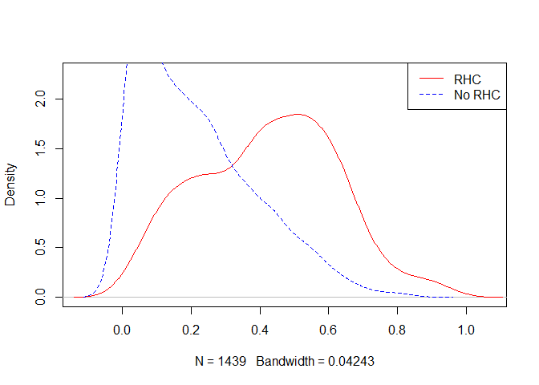

# Read data


```r
analytic.data <- readRDS("data/RHC.Rds")
baselinevars <- c("age","sex", "race","Disease.category", 
                  "Cancer", "DNR.status", "APACHE.III.score",
                  "Pr.2mo.survival","No.of.comorbidity",
                  "ADLs.2wk.prior","DASI.2wk.prior","Temperature",
                  "Heart.rate", "Blood.pressure","Respiratory.rate",
                  "WBC.count","PaO2.by.FIO2","PaCO2","pH",
                  "Creatinine","Albumin","GComa.Score")
```

# Propensity score (PS) analysis

## Table 1 (stratified by exposure)


```r
require(tableone)
tab1 <- CreateTableOne(vars = baselinevars,
               data = analytic.data, strata = "RHC", includeNA = TRUE, 
               test = FALSE, smd = TRUE)
tab1k <- kable(print(tab1, showAllLevels = TRUE, smd = TRUE)) %>%
  kable_styling(bootstrap_options = c("striped", "hover", "condensed", "responsive"), 
                full_width = FALSE)
```


```r
tab1k
```

<table class="table table-striped table-hover table-condensed table-responsive" style="width: auto !important; margin-left: auto; margin-right: auto;">
 <thead>
  <tr>
   <th style="text-align:left;">   </th>
   <th style="text-align:left;"> level </th>
   <th style="text-align:left;"> No RHC </th>
   <th style="text-align:left;"> RHC </th>
   <th style="text-align:left;"> SMD </th>
  </tr>
 </thead>
<tbody>
  <tr>
   <td style="text-align:left;"> n </td>
   <td style="text-align:left;">  </td>
   <td style="text-align:left;"> 1049 </td>
   <td style="text-align:left;"> 390 </td>
   <td style="text-align:left;">  </td>
  </tr>
  <tr>
   <td style="text-align:left;"> age (%) </td>
   <td style="text-align:left;"> [-Inf,50) </td>
   <td style="text-align:left;"> 264 (25.2) </td>
   <td style="text-align:left;"> 113 (29.0) </td>
   <td style="text-align:left;"> 0.288 </td>
  </tr>
  <tr>
   <td style="text-align:left;">  </td>
   <td style="text-align:left;"> [50,60) </td>
   <td style="text-align:left;"> 160 (15.3) </td>
   <td style="text-align:left;"> 85 (21.8) </td>
   <td style="text-align:left;">  </td>
  </tr>
  <tr>
   <td style="text-align:left;">  </td>
   <td style="text-align:left;"> [60,70) </td>
   <td style="text-align:left;"> 261 (24.9) </td>
   <td style="text-align:left;"> 99 (25.4) </td>
   <td style="text-align:left;">  </td>
  </tr>
  <tr>
   <td style="text-align:left;">  </td>
   <td style="text-align:left;"> [70,80) </td>
   <td style="text-align:left;"> 238 (22.7) </td>
   <td style="text-align:left;"> 70 (17.9) </td>
   <td style="text-align:left;">  </td>
  </tr>
  <tr>
   <td style="text-align:left;">  </td>
   <td style="text-align:left;"> [80, Inf) </td>
   <td style="text-align:left;"> 126 (12.0) </td>
   <td style="text-align:left;"> 23 ( 5.9) </td>
   <td style="text-align:left;">  </td>
  </tr>
  <tr>
   <td style="text-align:left;"> sex (%) </td>
   <td style="text-align:left;"> Male </td>
   <td style="text-align:left;"> 569 (54.2) </td>
   <td style="text-align:left;"> 253 (64.9) </td>
   <td style="text-align:left;"> 0.218 </td>
  </tr>
  <tr>
   <td style="text-align:left;">  </td>
   <td style="text-align:left;"> Female </td>
   <td style="text-align:left;"> 480 (45.8) </td>
   <td style="text-align:left;"> 137 (35.1) </td>
   <td style="text-align:left;">  </td>
  </tr>
  <tr>
   <td style="text-align:left;"> race (%) </td>
   <td style="text-align:left;"> white </td>
   <td style="text-align:left;"> 813 (77.5) </td>
   <td style="text-align:left;"> 297 (76.2) </td>
   <td style="text-align:left;"> 0.042 </td>
  </tr>
  <tr>
   <td style="text-align:left;">  </td>
   <td style="text-align:left;"> black </td>
   <td style="text-align:left;"> 176 (16.8) </td>
   <td style="text-align:left;"> 67 (17.2) </td>
   <td style="text-align:left;">  </td>
  </tr>
  <tr>
   <td style="text-align:left;">  </td>
   <td style="text-align:left;"> other </td>
   <td style="text-align:left;"> 60 ( 5.7) </td>
   <td style="text-align:left;"> 26 ( 6.7) </td>
   <td style="text-align:left;">  </td>
  </tr>
  <tr>
   <td style="text-align:left;"> Disease.category (%) </td>
   <td style="text-align:left;"> ARF </td>
   <td style="text-align:left;"> 429 (40.9) </td>
   <td style="text-align:left;"> 127 (32.6) </td>
   <td style="text-align:left;"> 0.682 </td>
  </tr>
  <tr>
   <td style="text-align:left;">  </td>
   <td style="text-align:left;"> CHF </td>
   <td style="text-align:left;"> 174 (16.6) </td>
   <td style="text-align:left;"> 129 (33.1) </td>
   <td style="text-align:left;">  </td>
  </tr>
  <tr>
   <td style="text-align:left;">  </td>
   <td style="text-align:left;"> MOSF </td>
   <td style="text-align:left;"> 180 (17.2) </td>
   <td style="text-align:left;"> 110 (28.2) </td>
   <td style="text-align:left;">  </td>
  </tr>
  <tr>
   <td style="text-align:left;">  </td>
   <td style="text-align:left;"> Other </td>
   <td style="text-align:left;"> 266 (25.4) </td>
   <td style="text-align:left;"> 24 ( 6.2) </td>
   <td style="text-align:left;">  </td>
  </tr>
  <tr>
   <td style="text-align:left;"> Cancer (%) </td>
   <td style="text-align:left;"> None </td>
   <td style="text-align:left;"> 797 (76.0) </td>
   <td style="text-align:left;"> 324 (83.1) </td>
   <td style="text-align:left;"> 0.178 </td>
  </tr>
  <tr>
   <td style="text-align:left;">  </td>
   <td style="text-align:left;"> Localized (Yes) </td>
   <td style="text-align:left;"> 171 (16.3) </td>
   <td style="text-align:left;"> 46 (11.8) </td>
   <td style="text-align:left;">  </td>
  </tr>
  <tr>
   <td style="text-align:left;">  </td>
   <td style="text-align:left;"> Metastatic </td>
   <td style="text-align:left;"> 81 ( 7.7) </td>
   <td style="text-align:left;"> 20 ( 5.1) </td>
   <td style="text-align:left;">  </td>
  </tr>
  <tr>
   <td style="text-align:left;"> DNR.status (%) </td>
   <td style="text-align:left;"> No </td>
   <td style="text-align:left;"> 962 (91.7) </td>
   <td style="text-align:left;"> 379 (97.2) </td>
   <td style="text-align:left;"> 0.241 </td>
  </tr>
  <tr>
   <td style="text-align:left;">  </td>
   <td style="text-align:left;"> Yes </td>
   <td style="text-align:left;"> 87 ( 8.3) </td>
   <td style="text-align:left;"> 11 ( 2.8) </td>
   <td style="text-align:left;">  </td>
  </tr>
  <tr>
   <td style="text-align:left;"> APACHE.III.score (mean (SD)) </td>
   <td style="text-align:left;">  </td>
   <td style="text-align:left;"> 48.36 (16.34) </td>
   <td style="text-align:left;"> 49.38 (19.71) </td>
   <td style="text-align:left;"> 0.057 </td>
  </tr>
  <tr>
   <td style="text-align:left;"> Pr.2mo.survival (mean (SD)) </td>
   <td style="text-align:left;">  </td>
   <td style="text-align:left;"> 0.70 (0.15) </td>
   <td style="text-align:left;"> 0.69 (0.17) </td>
   <td style="text-align:left;"> 0.079 </td>
  </tr>
  <tr>
   <td style="text-align:left;"> No.of.comorbidity (mean (SD)) </td>
   <td style="text-align:left;">  </td>
   <td style="text-align:left;"> 1.74 (1.22) </td>
   <td style="text-align:left;"> 1.76 (1.23) </td>
   <td style="text-align:left;"> 0.019 </td>
  </tr>
  <tr>
   <td style="text-align:left;"> ADLs.2wk.prior (mean (SD)) </td>
   <td style="text-align:left;">  </td>
   <td style="text-align:left;"> 1.24 (1.86) </td>
   <td style="text-align:left;"> 1.02 (1.69) </td>
   <td style="text-align:left;"> 0.129 </td>
  </tr>
  <tr>
   <td style="text-align:left;"> DASI.2wk.prior (mean (SD)) </td>
   <td style="text-align:left;">  </td>
   <td style="text-align:left;"> 20.36 (7.28) </td>
   <td style="text-align:left;"> 20.36 (6.96) </td>
   <td style="text-align:left;"> &lt;0.001 </td>
  </tr>
  <tr>
   <td style="text-align:left;"> Temperature (mean (SD)) </td>
   <td style="text-align:left;">  </td>
   <td style="text-align:left;"> 37.35 (1.66) </td>
   <td style="text-align:left;"> 37.24 (1.61) </td>
   <td style="text-align:left;"> 0.063 </td>
  </tr>
  <tr>
   <td style="text-align:left;"> Heart.rate (mean (SD)) </td>
   <td style="text-align:left;">  </td>
   <td style="text-align:left;"> 112.23 (38.20) </td>
   <td style="text-align:left;"> 108.66 (39.22) </td>
   <td style="text-align:left;"> 0.092 </td>
  </tr>
  <tr>
   <td style="text-align:left;"> Blood.pressure (mean (SD)) </td>
   <td style="text-align:left;">  </td>
   <td style="text-align:left;"> 87.35 (37.97) </td>
   <td style="text-align:left;"> 70.91 (33.38) </td>
   <td style="text-align:left;"> 0.460 </td>
  </tr>
  <tr>
   <td style="text-align:left;"> Respiratory.rate (mean (SD)) </td>
   <td style="text-align:left;">  </td>
   <td style="text-align:left;"> 30.43 (11.65) </td>
   <td style="text-align:left;"> 25.25 (12.73) </td>
   <td style="text-align:left;"> 0.424 </td>
  </tr>
  <tr>
   <td style="text-align:left;"> WBC.count (mean (SD)) </td>
   <td style="text-align:left;">  </td>
   <td style="text-align:left;"> 14.45 (11.16) </td>
   <td style="text-align:left;"> 14.75 (13.09) </td>
   <td style="text-align:left;"> 0.024 </td>
  </tr>
  <tr>
   <td style="text-align:left;"> PaO2.by.FIO2 (mean (SD)) </td>
   <td style="text-align:left;">  </td>
   <td style="text-align:left;"> 250.90 (112.53) </td>
   <td style="text-align:left;"> 238.90 (104.11) </td>
   <td style="text-align:left;"> 0.111 </td>
  </tr>
  <tr>
   <td style="text-align:left;"> PaCO2 (mean (SD)) </td>
   <td style="text-align:left;">  </td>
   <td style="text-align:left;"> 41.77 (14.86) </td>
   <td style="text-align:left;"> 37.16 (8.57) </td>
   <td style="text-align:left;"> 0.380 </td>
  </tr>
  <tr>
   <td style="text-align:left;"> pH (mean (SD)) </td>
   <td style="text-align:left;">  </td>
   <td style="text-align:left;"> 7.39 (0.10) </td>
   <td style="text-align:left;"> 7.40 (0.09) </td>
   <td style="text-align:left;"> 0.166 </td>
  </tr>
  <tr>
   <td style="text-align:left;"> Creatinine (mean (SD)) </td>
   <td style="text-align:left;">  </td>
   <td style="text-align:left;"> 2.03 (2.27) </td>
   <td style="text-align:left;"> 2.22 (2.05) </td>
   <td style="text-align:left;"> 0.084 </td>
  </tr>
  <tr>
   <td style="text-align:left;"> Albumin (mean (SD)) </td>
   <td style="text-align:left;">  </td>
   <td style="text-align:left;"> 3.26 (0.65) </td>
   <td style="text-align:left;"> 3.19 (0.64) </td>
   <td style="text-align:left;"> 0.108 </td>
  </tr>
  <tr>
   <td style="text-align:left;"> GComa.Score (mean (SD)) </td>
   <td style="text-align:left;">  </td>
   <td style="text-align:left;"> 5.25 (15.83) </td>
   <td style="text-align:left;"> 6.54 (17.20) </td>
   <td style="text-align:left;"> 0.078 </td>
  </tr>
</tbody>
</table>

## PS modelling


```r
ps.formula <- as.formula(I(RHC == "RHC") ~ age+sex+race+Disease.category+ 
                                Cancer+DNR.status+APACHE.III.score+
                                Pr.2mo.survival+No.of.comorbidity+
                                ADLs.2wk.prior+DASI.2wk.prior+Temperature+
                                Heart.rate+Blood.pressure+Respiratory.rate+
                                WBC.count+PaO2.by.FIO2+PaCO2+pH+
                                Creatinine+Albumin+GComa.Score)
# fit logistic regression
PS.fit <- glm(ps.formula,family="binomial", data=analytic.data)
# extract propensity scores
analytic.data$PS <- predict(PS.fit, newdata = analytic.data, type="response")
# summarize propensity scores
summary(analytic.data$PS)
```

```
##     Min.  1st Qu.   Median     Mean  3rd Qu.     Max. 
## 0.003351 0.097465 0.233698 0.271022 0.417233 0.941860
```

```r
# summarize propensity scores by exposure group
tapply(analytic.data$PS, analytic.data$RHC, summary)
```

```
## $`No RHC`
##     Min.  1st Qu.   Median     Mean  3rd Qu.     Max. 
## 0.003351 0.066781 0.176932 0.214205 0.321125 0.845037 
## 
## $RHC
##    Min. 1st Qu.  Median    Mean 3rd Qu.    Max. 
## 0.02451 0.26598 0.43403 0.42384 0.56963 0.94186
```

```r
# plot propensity scores by exposure group
plot(density(analytic.data$PS), col = "white", type = "n", main = "")
lines(density(analytic.data$PS[analytic.data$RHC == "RHC"]), 
     col = "red")
lines(density(analytic.data$PS[analytic.data$RHC == "No RHC"]), 
      col = "blue", lty = 2)
legend("topright", c("RHC","No RHC"), 
       col = c("red", "blue"), lty=1:2)
```

<!-- -->

# PS Weighting (ATE)

## Step 1
Specify the propensity score model to estimate propensity scores


```r
ps.formula <- as.formula(I(RHC == "RHC") ~ age+sex+race+Disease.category+ 
                                Cancer+DNR.status+APACHE.III.score+
                                Pr.2mo.survival+No.of.comorbidity+
                                ADLs.2wk.prior+DASI.2wk.prior+Temperature+
                                Heart.rate+Blood.pressure+Respiratory.rate+
                                WBC.count+PaO2.by.FIO2+PaCO2+pH+
                                Creatinine+Albumin+GComa.Score)
```

## Step 2

Convert propensity scores to IPW (ATE formula)


```r
analytic.data$IPW <- ifelse(analytic.data$RHC=="RHC", 
                            1/analytic.data$PS, 
                            1/(1-analytic.data$PS))
summary(analytic.data$IPW)
```

```
##    Min. 1st Qu.  Median    Mean 3rd Qu.    Max. 
##   1.003   1.116   1.360   2.016   1.895  40.797
```


```r
tapply(analytic.data$IPW, 
       analytic.data$RHC, 
       summary)
```

```
## $`No RHC`
##    Min. 1st Qu.  Median    Mean 3rd Qu.    Max. 
##   1.003   1.072   1.215   1.365   1.473   6.453 
## 
## $RHC
##    Min. 1st Qu.  Median    Mean 3rd Qu.    Max. 
##   1.062   1.756   2.304   3.767   3.760  40.797
```

## Step 3

Compare the similarity of baseline characteristics between treated and untreated subjects in a the propensity score-weighted sample. In this case, we will compare SMD < 0.1 or not


```r
require(survey)
analytic.design <- svydesign(id=~1,weights=~IPW, 
                             data=analytic.data, nest=TRUE)
tab1m <- svyCreateTableOne(vars = baselinevars,
               data = analytic.design, strata = "RHC", includeNA = TRUE, 
               test = FALSE, smd = TRUE)
tab1mk <- kable(print(tab1m, showAllLevels = TRUE, smd = TRUE)) %>%
  kable_styling(bootstrap_options = c("striped", "hover", "condensed", "responsive"), 
                full_width = FALSE)
```


```r
tab1mk
```

<table class="table table-striped table-hover table-condensed table-responsive" style="width: auto !important; margin-left: auto; margin-right: auto;">
 <thead>
  <tr>
   <th style="text-align:left;">   </th>
   <th style="text-align:left;"> level </th>
   <th style="text-align:left;"> No RHC </th>
   <th style="text-align:left;"> RHC </th>
   <th style="text-align:left;"> SMD </th>
  </tr>
 </thead>
<tbody>
  <tr>
   <td style="text-align:left;"> n </td>
   <td style="text-align:left;">  </td>
   <td style="text-align:left;"> 1431.4 </td>
   <td style="text-align:left;"> 1469.2 </td>
   <td style="text-align:left;">  </td>
  </tr>
  <tr>
   <td style="text-align:left;"> age (%) </td>
   <td style="text-align:left;"> [-Inf,50) </td>
   <td style="text-align:left;"> 374.0 (26.1) </td>
   <td style="text-align:left;"> 412.1 (28.0) </td>
   <td style="text-align:left;"> 0.056 </td>
  </tr>
  <tr>
   <td style="text-align:left;">  </td>
   <td style="text-align:left;"> [50,60) </td>
   <td style="text-align:left;"> 234.8 (16.4) </td>
   <td style="text-align:left;"> 230.6 (15.7) </td>
   <td style="text-align:left;">  </td>
  </tr>
  <tr>
   <td style="text-align:left;">  </td>
   <td style="text-align:left;"> [60,70) </td>
   <td style="text-align:left;"> 363.1 (25.4) </td>
   <td style="text-align:left;"> 359.5 (24.5) </td>
   <td style="text-align:left;">  </td>
  </tr>
  <tr>
   <td style="text-align:left;">  </td>
   <td style="text-align:left;"> [70,80) </td>
   <td style="text-align:left;"> 310.1 (21.7) </td>
   <td style="text-align:left;"> 328.1 (22.3) </td>
   <td style="text-align:left;">  </td>
  </tr>
  <tr>
   <td style="text-align:left;">  </td>
   <td style="text-align:left;"> [80, Inf) </td>
   <td style="text-align:left;"> 149.4 (10.4) </td>
   <td style="text-align:left;"> 138.9 ( 9.5) </td>
   <td style="text-align:left;">  </td>
  </tr>
  <tr>
   <td style="text-align:left;"> sex (%) </td>
   <td style="text-align:left;"> Male </td>
   <td style="text-align:left;"> 808.5 (56.5) </td>
   <td style="text-align:left;"> 777.8 (52.9) </td>
   <td style="text-align:left;"> 0.071 </td>
  </tr>
  <tr>
   <td style="text-align:left;">  </td>
   <td style="text-align:left;"> Female </td>
   <td style="text-align:left;"> 622.9 (43.5) </td>
   <td style="text-align:left;"> 691.4 (47.1) </td>
   <td style="text-align:left;">  </td>
  </tr>
  <tr>
   <td style="text-align:left;"> race (%) </td>
   <td style="text-align:left;"> white </td>
   <td style="text-align:left;"> 1103.6 (77.1) </td>
   <td style="text-align:left;"> 1150.4 (78.3) </td>
   <td style="text-align:left;"> 0.029 </td>
  </tr>
  <tr>
   <td style="text-align:left;">  </td>
   <td style="text-align:left;"> black </td>
   <td style="text-align:left;"> 240.3 (16.8) </td>
   <td style="text-align:left;"> 234.0 (15.9) </td>
   <td style="text-align:left;">  </td>
  </tr>
  <tr>
   <td style="text-align:left;">  </td>
   <td style="text-align:left;"> other </td>
   <td style="text-align:left;"> 87.5 ( 6.1) </td>
   <td style="text-align:left;"> 84.8 ( 5.8) </td>
   <td style="text-align:left;">  </td>
  </tr>
  <tr>
   <td style="text-align:left;"> Disease.category (%) </td>
   <td style="text-align:left;"> ARF </td>
   <td style="text-align:left;"> 548.7 (38.3) </td>
   <td style="text-align:left;"> 622.5 (42.4) </td>
   <td style="text-align:left;"> 0.105 </td>
  </tr>
  <tr>
   <td style="text-align:left;">  </td>
   <td style="text-align:left;"> CHF </td>
   <td style="text-align:left;"> 300.3 (21.0) </td>
   <td style="text-align:left;"> 291.3 (19.8) </td>
   <td style="text-align:left;">  </td>
  </tr>
  <tr>
   <td style="text-align:left;">  </td>
   <td style="text-align:left;"> MOSF </td>
   <td style="text-align:left;"> 292.2 (20.4) </td>
   <td style="text-align:left;"> 307.4 (20.9) </td>
   <td style="text-align:left;">  </td>
  </tr>
  <tr>
   <td style="text-align:left;">  </td>
   <td style="text-align:left;"> Other </td>
   <td style="text-align:left;"> 290.2 (20.3) </td>
   <td style="text-align:left;"> 248.0 (16.9) </td>
   <td style="text-align:left;">  </td>
  </tr>
  <tr>
   <td style="text-align:left;"> Cancer (%) </td>
   <td style="text-align:left;"> None </td>
   <td style="text-align:left;"> 1111.4 (77.6) </td>
   <td style="text-align:left;"> 1130.9 (77.0) </td>
   <td style="text-align:left;"> 0.021 </td>
  </tr>
  <tr>
   <td style="text-align:left;">  </td>
   <td style="text-align:left;"> Localized (Yes) </td>
   <td style="text-align:left;"> 219.9 (15.4) </td>
   <td style="text-align:left;"> 237.0 (16.1) </td>
   <td style="text-align:left;">  </td>
  </tr>
  <tr>
   <td style="text-align:left;">  </td>
   <td style="text-align:left;"> Metastatic </td>
   <td style="text-align:left;"> 100.1 ( 7.0) </td>
   <td style="text-align:left;"> 101.3 ( 6.9) </td>
   <td style="text-align:left;">  </td>
  </tr>
  <tr>
   <td style="text-align:left;"> DNR.status (%) </td>
   <td style="text-align:left;"> No </td>
   <td style="text-align:left;"> 1333.2 (93.1) </td>
   <td style="text-align:left;"> 1417.0 (96.4) </td>
   <td style="text-align:left;"> 0.149 </td>
  </tr>
  <tr>
   <td style="text-align:left;">  </td>
   <td style="text-align:left;"> Yes </td>
   <td style="text-align:left;"> 98.2 ( 6.9) </td>
   <td style="text-align:left;"> 52.2 ( 3.6) </td>
   <td style="text-align:left;">  </td>
  </tr>
  <tr>
   <td style="text-align:left;"> APACHE.III.score (mean (SD)) </td>
   <td style="text-align:left;">  </td>
   <td style="text-align:left;"> 48.73 (17.04) </td>
   <td style="text-align:left;"> 51.22 (18.74) </td>
   <td style="text-align:left;"> 0.139 </td>
  </tr>
  <tr>
   <td style="text-align:left;"> Pr.2mo.survival (mean (SD)) </td>
   <td style="text-align:left;">  </td>
   <td style="text-align:left;"> 0.70 (0.16) </td>
   <td style="text-align:left;"> 0.69 (0.15) </td>
   <td style="text-align:left;"> 0.070 </td>
  </tr>
  <tr>
   <td style="text-align:left;"> No.of.comorbidity (mean (SD)) </td>
   <td style="text-align:left;">  </td>
   <td style="text-align:left;"> 1.75 (1.23) </td>
   <td style="text-align:left;"> 1.73 (1.25) </td>
   <td style="text-align:left;"> 0.018 </td>
  </tr>
  <tr>
   <td style="text-align:left;"> ADLs.2wk.prior (mean (SD)) </td>
   <td style="text-align:left;">  </td>
   <td style="text-align:left;"> 1.19 (1.82) </td>
   <td style="text-align:left;"> 1.08 (1.75) </td>
   <td style="text-align:left;"> 0.060 </td>
  </tr>
  <tr>
   <td style="text-align:left;"> DASI.2wk.prior (mean (SD)) </td>
   <td style="text-align:left;">  </td>
   <td style="text-align:left;"> 20.36 (7.21) </td>
   <td style="text-align:left;"> 20.92 (7.28) </td>
   <td style="text-align:left;"> 0.078 </td>
  </tr>
  <tr>
   <td style="text-align:left;"> Temperature (mean (SD)) </td>
   <td style="text-align:left;">  </td>
   <td style="text-align:left;"> 37.32 (1.69) </td>
   <td style="text-align:left;"> 37.29 (1.60) </td>
   <td style="text-align:left;"> 0.019 </td>
  </tr>
  <tr>
   <td style="text-align:left;"> Heart.rate (mean (SD)) </td>
   <td style="text-align:left;">  </td>
   <td style="text-align:left;"> 111.83 (38.55) </td>
   <td style="text-align:left;"> 113.53 (36.80) </td>
   <td style="text-align:left;"> 0.045 </td>
  </tr>
  <tr>
   <td style="text-align:left;"> Blood.pressure (mean (SD)) </td>
   <td style="text-align:left;">  </td>
   <td style="text-align:left;"> 83.45 (37.02) </td>
   <td style="text-align:left;"> 85.00 (37.71) </td>
   <td style="text-align:left;"> 0.041 </td>
  </tr>
  <tr>
   <td style="text-align:left;"> Respiratory.rate (mean (SD)) </td>
   <td style="text-align:left;">  </td>
   <td style="text-align:left;"> 29.24 (11.95) </td>
   <td style="text-align:left;"> 31.38 (14.86) </td>
   <td style="text-align:left;"> 0.159 </td>
  </tr>
  <tr>
   <td style="text-align:left;"> WBC.count (mean (SD)) </td>
   <td style="text-align:left;">  </td>
   <td style="text-align:left;"> 14.59 (11.68) </td>
   <td style="text-align:left;"> 15.46 (13.56) </td>
   <td style="text-align:left;"> 0.068 </td>
  </tr>
  <tr>
   <td style="text-align:left;"> PaO2.by.FIO2 (mean (SD)) </td>
   <td style="text-align:left;">  </td>
   <td style="text-align:left;"> 247.06 (110.45) </td>
   <td style="text-align:left;"> 241.71 (99.34) </td>
   <td style="text-align:left;"> 0.051 </td>
  </tr>
  <tr>
   <td style="text-align:left;"> PaCO2 (mean (SD)) </td>
   <td style="text-align:left;">  </td>
   <td style="text-align:left;"> 40.45 (13.81) </td>
   <td style="text-align:left;"> 39.33 (10.42) </td>
   <td style="text-align:left;"> 0.092 </td>
  </tr>
  <tr>
   <td style="text-align:left;"> pH (mean (SD)) </td>
   <td style="text-align:left;">  </td>
   <td style="text-align:left;"> 7.39 (0.10) </td>
   <td style="text-align:left;"> 7.38 (0.09) </td>
   <td style="text-align:left;"> 0.060 </td>
  </tr>
  <tr>
   <td style="text-align:left;"> Creatinine (mean (SD)) </td>
   <td style="text-align:left;">  </td>
   <td style="text-align:left;"> 2.09 (2.30) </td>
   <td style="text-align:left;"> 2.06 (1.79) </td>
   <td style="text-align:left;"> 0.015 </td>
  </tr>
  <tr>
   <td style="text-align:left;"> Albumin (mean (SD)) </td>
   <td style="text-align:left;">  </td>
   <td style="text-align:left;"> 3.23 (0.66) </td>
   <td style="text-align:left;"> 3.10 (0.73) </td>
   <td style="text-align:left;"> 0.179 </td>
  </tr>
  <tr>
   <td style="text-align:left;"> GComa.Score (mean (SD)) </td>
   <td style="text-align:left;">  </td>
   <td style="text-align:left;"> 5.56 (16.57) </td>
   <td style="text-align:left;"> 6.63 (15.32) </td>
   <td style="text-align:left;"> 0.067 </td>
  </tr>
</tbody>
</table>


## Step 4

Estimate the effect of treatment on outcomes using propensity score-weighted sample


```r
fit3 <- glm(I(Death=="Yes")~RHC,
            family=binomial, data = analytic.data,
            weights = IPW)
```

```
## Warning in eval(family$initialize): non-integer #successes in a binomial glm!
```

```r
summ(fit3, exp = TRUE)
```

```
## Warning in eval(family$initialize): non-integer #successes in a binomial glm!
```

<table class="table table-striped table-hover table-condensed table-responsive" style="width: auto !important; margin-left: auto; margin-right: auto;">
<tbody>
  <tr>
   <td style="text-align:left;font-weight: bold;"> Observations </td>
   <td style="text-align:right;"> 1439 </td>
  </tr>
  <tr>
   <td style="text-align:left;font-weight: bold;"> Dependent variable </td>
   <td style="text-align:right;"> I(Death == "Yes") </td>
  </tr>
  <tr>
   <td style="text-align:left;font-weight: bold;"> Type </td>
   <td style="text-align:right;"> Generalized linear model </td>
  </tr>
  <tr>
   <td style="text-align:left;font-weight: bold;"> Family </td>
   <td style="text-align:right;"> binomial </td>
  </tr>
  <tr>
   <td style="text-align:left;font-weight: bold;"> Link </td>
   <td style="text-align:right;"> logit </td>
  </tr>
</tbody>
</table> <table class="table table-striped table-hover table-condensed table-responsive" style="width: auto !important; margin-left: auto; margin-right: auto;">
<tbody>
  <tr>
   <td style="text-align:left;font-weight: bold;"> χ²(1) </td>
   <td style="text-align:right;"> 6.07 </td>
  </tr>
  <tr>
   <td style="text-align:left;font-weight: bold;"> Pseudo-R² (Cragg-Uhler) </td>
   <td style="text-align:right;"> 0.00 </td>
  </tr>
  <tr>
   <td style="text-align:left;font-weight: bold;"> Pseudo-R² (McFadden) </td>
   <td style="text-align:right;"> 0.00 </td>
  </tr>
  <tr>
   <td style="text-align:left;font-weight: bold;"> AIC </td>
   <td style="text-align:right;"> 3889.37 </td>
  </tr>
  <tr>
   <td style="text-align:left;font-weight: bold;"> BIC </td>
   <td style="text-align:right;"> 3899.91 </td>
  </tr>
</tbody>
</table> <table class="table table-striped table-hover table-condensed table-responsive" style="width: auto !important; margin-left: auto; margin-right: auto;">
 <thead>
  <tr>
   <th style="text-align:left;">   </th>
   <th style="text-align:right;"> exp(Est.) </th>
   <th style="text-align:right;"> 2.5% </th>
   <th style="text-align:right;"> 97.5% </th>
   <th style="text-align:right;"> z val. </th>
   <th style="text-align:right;"> p </th>
  </tr>
 </thead>
<tbody>
  <tr>
   <td style="text-align:left;font-weight: bold;"> (Intercept) </td>
   <td style="text-align:right;"> 0.94 </td>
   <td style="text-align:right;"> 0.85 </td>
   <td style="text-align:right;"> 1.05 </td>
   <td style="text-align:right;"> -1.07 </td>
   <td style="text-align:right;"> 0.28 </td>
  </tr>
  <tr>
   <td style="text-align:left;font-weight: bold;"> RHCRHC </td>
   <td style="text-align:right;"> 0.83 </td>
   <td style="text-align:right;"> 0.72 </td>
   <td style="text-align:right;"> 0.96 </td>
   <td style="text-align:right;"> -2.46 </td>
   <td style="text-align:right;"> 0.01 </td>
  </tr>
</tbody>
<tfoot><tr><td style="padding: 0; border: 0;" colspan="100%">
<sup></sup> Standard errors: MLE</td></tr></tfoot>
</table>

```r
publish(fit3)
```

```
##  Variable  Units OddsRatio       CI.95   p-value 
##       RHC No RHC       Ref                       
##              RHC      0.83 [0.72;0.96]   0.01382
```

General idea is that if any SMD >= 0.1, go back to the modelling stage, and change the PS model specification. If all else fails, adjust for the variables that are indicating some residual imbalance.


```r
fit3 <- glm(I(Death=="Yes")~RHC+
              Disease.category+DNR.status+
              APACHE.III.score+Respiratory.rate+Albumin ,
            family=binomial, data = analytic.data,
            weights = IPW)
```

```
## Warning in eval(family$initialize): non-integer #successes in a binomial glm!
```

```r
summ(fit3, exp = TRUE)
```

```
## Warning in eval(family$initialize): non-integer #successes in a binomial glm!
```

<table class="table table-striped table-hover table-condensed table-responsive" style="width: auto !important; margin-left: auto; margin-right: auto;">
<tbody>
  <tr>
   <td style="text-align:left;font-weight: bold;"> Observations </td>
   <td style="text-align:right;"> 1439 </td>
  </tr>
  <tr>
   <td style="text-align:left;font-weight: bold;"> Dependent variable </td>
   <td style="text-align:right;"> I(Death == "Yes") </td>
  </tr>
  <tr>
   <td style="text-align:left;font-weight: bold;"> Type </td>
   <td style="text-align:right;"> Generalized linear model </td>
  </tr>
  <tr>
   <td style="text-align:left;font-weight: bold;"> Family </td>
   <td style="text-align:right;"> binomial </td>
  </tr>
  <tr>
   <td style="text-align:left;font-weight: bold;"> Link </td>
   <td style="text-align:right;"> logit </td>
  </tr>
</tbody>
</table> <table class="table table-striped table-hover table-condensed table-responsive" style="width: auto !important; margin-left: auto; margin-right: auto;">
<tbody>
  <tr>
   <td style="text-align:left;font-weight: bold;"> χ²(8) </td>
   <td style="text-align:right;"> 200.41 </td>
  </tr>
  <tr>
   <td style="text-align:left;font-weight: bold;"> Pseudo-R² (Cragg-Uhler) </td>
   <td style="text-align:right;"> 0.14 </td>
  </tr>
  <tr>
   <td style="text-align:left;font-weight: bold;"> Pseudo-R² (McFadden) </td>
   <td style="text-align:right;"> 0.05 </td>
  </tr>
  <tr>
   <td style="text-align:left;font-weight: bold;"> AIC </td>
   <td style="text-align:right;"> 3709.63 </td>
  </tr>
  <tr>
   <td style="text-align:left;font-weight: bold;"> BIC </td>
   <td style="text-align:right;"> 3757.08 </td>
  </tr>
</tbody>
</table> <table class="table table-striped table-hover table-condensed table-responsive" style="width: auto !important; margin-left: auto; margin-right: auto;">
 <thead>
  <tr>
   <th style="text-align:left;">   </th>
   <th style="text-align:right;"> exp(Est.) </th>
   <th style="text-align:right;"> 2.5% </th>
   <th style="text-align:right;"> 97.5% </th>
   <th style="text-align:right;"> z val. </th>
   <th style="text-align:right;"> p </th>
  </tr>
 </thead>
<tbody>
  <tr>
   <td style="text-align:left;font-weight: bold;"> (Intercept) </td>
   <td style="text-align:right;"> 0.41 </td>
   <td style="text-align:right;"> 0.24 </td>
   <td style="text-align:right;"> 0.71 </td>
   <td style="text-align:right;"> -3.22 </td>
   <td style="text-align:right;"> 0.00 </td>
  </tr>
  <tr>
   <td style="text-align:left;font-weight: bold;"> RHCRHC </td>
   <td style="text-align:right;"> 0.91 </td>
   <td style="text-align:right;"> 0.78 </td>
   <td style="text-align:right;"> 1.05 </td>
   <td style="text-align:right;"> -1.28 </td>
   <td style="text-align:right;"> 0.20 </td>
  </tr>
  <tr>
   <td style="text-align:left;font-weight: bold;"> Disease.categoryCHF </td>
   <td style="text-align:right;"> 2.29 </td>
   <td style="text-align:right;"> 1.84 </td>
   <td style="text-align:right;"> 2.86 </td>
   <td style="text-align:right;"> 7.44 </td>
   <td style="text-align:right;"> 0.00 </td>
  </tr>
  <tr>
   <td style="text-align:left;font-weight: bold;"> Disease.categoryMOSF </td>
   <td style="text-align:right;"> 2.11 </td>
   <td style="text-align:right;"> 1.70 </td>
   <td style="text-align:right;"> 2.62 </td>
   <td style="text-align:right;"> 6.79 </td>
   <td style="text-align:right;"> 0.00 </td>
  </tr>
  <tr>
   <td style="text-align:left;font-weight: bold;"> Disease.categoryOther </td>
   <td style="text-align:right;"> 2.15 </td>
   <td style="text-align:right;"> 1.73 </td>
   <td style="text-align:right;"> 2.66 </td>
   <td style="text-align:right;"> 7.02 </td>
   <td style="text-align:right;"> 0.00 </td>
  </tr>
  <tr>
   <td style="text-align:left;font-weight: bold;"> DNR.statusYes </td>
   <td style="text-align:right;"> 2.98 </td>
   <td style="text-align:right;"> 2.05 </td>
   <td style="text-align:right;"> 4.32 </td>
   <td style="text-align:right;"> 5.72 </td>
   <td style="text-align:right;"> 0.00 </td>
  </tr>
  <tr>
   <td style="text-align:left;font-weight: bold;"> APACHE.III.score </td>
   <td style="text-align:right;"> 1.01 </td>
   <td style="text-align:right;"> 1.00 </td>
   <td style="text-align:right;"> 1.01 </td>
   <td style="text-align:right;"> 2.55 </td>
   <td style="text-align:right;"> 0.01 </td>
  </tr>
  <tr>
   <td style="text-align:left;font-weight: bold;"> Respiratory.rate </td>
   <td style="text-align:right;"> 0.98 </td>
   <td style="text-align:right;"> 0.98 </td>
   <td style="text-align:right;"> 0.99 </td>
   <td style="text-align:right;"> -5.10 </td>
   <td style="text-align:right;"> 0.00 </td>
  </tr>
  <tr>
   <td style="text-align:left;font-weight: bold;"> Albumin </td>
   <td style="text-align:right;"> 1.14 </td>
   <td style="text-align:right;"> 1.01 </td>
   <td style="text-align:right;"> 1.29 </td>
   <td style="text-align:right;"> 2.05 </td>
   <td style="text-align:right;"> 0.04 </td>
  </tr>
</tbody>
<tfoot><tr><td style="padding: 0; border: 0;" colspan="100%">
<sup></sup> Standard errors: MLE</td></tr></tfoot>
</table>

```r
publish(fit3)
```

```
##          Variable  Units OddsRatio       CI.95   p-value 
##               RHC No RHC       Ref                       
##                      RHC      0.91 [0.78;1.05]   0.20046 
##  Disease.category    ARF       Ref                       
##                      CHF      2.29 [1.84;2.86]   < 1e-04 
##                     MOSF      2.11 [1.70;2.62]   < 1e-04 
##                    Other      2.15 [1.73;2.66]   < 1e-04 
##        DNR.status     No       Ref                       
##                      Yes      2.98 [2.05;4.32]   < 1e-04 
##  APACHE.III.score             1.01 [1.00;1.01]   0.01089 
##  Respiratory.rate             0.98 [0.98;0.99]   < 1e-04 
##           Albumin             1.14 [1.01;1.29]   0.04005
```

# Truncation 


```r
tr <- .01 # checking
analytic.data$IPW.tr <- analytic.data$IPW
IPW.cut <- as.numeric(quantile(analytic.data$IPW.tr, probs = c(tr, (1-tr)), na.rm = TRUE))
analytic.data$IPW.tr[analytic.data$IPW.tr< IPW.cut[1]] <- IPW.cut[1]
analytic.data$IPW.tr[analytic.data$IPW.tr> IPW.cut[2]] <- IPW.cut[2]
summary(analytic.data$IPW.tr)
```

```
##    Min. 1st Qu.  Median    Mean 3rd Qu.    Max. 
##   1.010   1.116   1.360   1.895   1.895  11.240
```

```r
tapply(analytic.data$IPW.tr, analytic.data$RHC, summary)
```

```
## $`No RHC`
##    Min. 1st Qu.  Median    Mean 3rd Qu.    Max. 
##   1.010   1.072   1.215   1.365   1.473   6.453 
## 
## $RHC
##    Min. 1st Qu.  Median    Mean 3rd Qu.    Max. 
##   1.062   1.756   2.304   3.320   3.760  11.240
```
