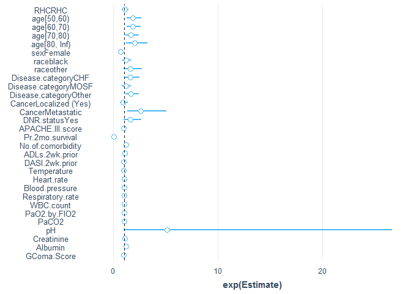

# Read data


```r
analytic.data <- readRDS("data/RHC.Rds")
```

# Regression


```r
fit2 <- glm(I(Death=="Yes")~RHC+age+sex+race+Disease.category+ 
                                Cancer+DNR.status+APACHE.III.score+
                                Pr.2mo.survival+No.of.comorbidity+
                                ADLs.2wk.prior+DASI.2wk.prior+Temperature+
                                Heart.rate+Blood.pressure+Respiratory.rate+
                                WBC.count+PaO2.by.FIO2+PaCO2+pH+
                                Creatinine+Albumin+GComa.Score,
            family=binomial, data = analytic.data)
summ(fit2, conf = TRUE, digits = 2, exp = TRUE)
```

<table class="table table-striped table-hover table-condensed table-responsive" style="width: auto !important; margin-left: auto; margin-right: auto;">
<tbody>
  <tr>
   <td style="text-align:left;font-weight: bold;"> Observations </td>
   <td style="text-align:right;"> 1439 </td>
  </tr>
  <tr>
   <td style="text-align:left;font-weight: bold;"> Dependent variable </td>
   <td style="text-align:right;"> I(Death == "Yes") </td>
  </tr>
  <tr>
   <td style="text-align:left;font-weight: bold;"> Type </td>
   <td style="text-align:right;"> Generalized linear model </td>
  </tr>
  <tr>
   <td style="text-align:left;font-weight: bold;"> Family </td>
   <td style="text-align:right;"> binomial </td>
  </tr>
  <tr>
   <td style="text-align:left;font-weight: bold;"> Link </td>
   <td style="text-align:right;"> logit </td>
  </tr>
</tbody>
</table> <table class="table table-striped table-hover table-condensed table-responsive" style="width: auto !important; margin-left: auto; margin-right: auto;">
<tbody>
  <tr>
   <td style="text-align:left;font-weight: bold;"> χ²(30) </td>
   <td style="text-align:right;"> 304.84 </td>
  </tr>
  <tr>
   <td style="text-align:left;font-weight: bold;"> Pseudo-R² (Cragg-Uhler) </td>
   <td style="text-align:right;"> 0.25 </td>
  </tr>
  <tr>
   <td style="text-align:left;font-weight: bold;"> Pseudo-R² (McFadden) </td>
   <td style="text-align:right;"> 0.15 </td>
  </tr>
  <tr>
   <td style="text-align:left;font-weight: bold;"> AIC </td>
   <td style="text-align:right;"> 1751.53 </td>
  </tr>
  <tr>
   <td style="text-align:left;font-weight: bold;"> BIC </td>
   <td style="text-align:right;"> 1914.96 </td>
  </tr>
</tbody>
</table> <table class="table table-striped table-hover table-condensed table-responsive" style="width: auto !important; margin-left: auto; margin-right: auto;">
 <thead>
  <tr>
   <th style="text-align:left;">   </th>
   <th style="text-align:right;"> exp(Est.) </th>
   <th style="text-align:right;"> 2.5% </th>
   <th style="text-align:right;"> 97.5% </th>
   <th style="text-align:right;"> z val. </th>
   <th style="text-align:right;"> p </th>
  </tr>
 </thead>
<tbody>
  <tr>
   <td style="text-align:left;font-weight: bold;"> (Intercept) </td>
   <td style="text-align:right;"> 0.00 </td>
   <td style="text-align:right;"> 0.00 </td>
   <td style="text-align:right;"> 52.27 </td>
   <td style="text-align:right;"> -1.35 </td>
   <td style="text-align:right;"> 0.18 </td>
  </tr>
  <tr>
   <td style="text-align:left;font-weight: bold;"> RHCRHC </td>
   <td style="text-align:right;"> 1.07 </td>
   <td style="text-align:right;"> 0.81 </td>
   <td style="text-align:right;"> 1.43 </td>
   <td style="text-align:right;"> 0.48 </td>
   <td style="text-align:right;"> 0.63 </td>
  </tr>
  <tr>
   <td style="text-align:left;font-weight: bold;"> age[50,60) </td>
   <td style="text-align:right;"> 1.84 </td>
   <td style="text-align:right;"> 1.26 </td>
   <td style="text-align:right;"> 2.68 </td>
   <td style="text-align:right;"> 3.16 </td>
   <td style="text-align:right;"> 0.00 </td>
  </tr>
  <tr>
   <td style="text-align:left;font-weight: bold;"> age[60,70) </td>
   <td style="text-align:right;"> 1.82 </td>
   <td style="text-align:right;"> 1.28 </td>
   <td style="text-align:right;"> 2.60 </td>
   <td style="text-align:right;"> 3.30 </td>
   <td style="text-align:right;"> 0.00 </td>
  </tr>
  <tr>
   <td style="text-align:left;font-weight: bold;"> age[70,80) </td>
   <td style="text-align:right;"> 1.65 </td>
   <td style="text-align:right;"> 1.13 </td>
   <td style="text-align:right;"> 2.43 </td>
   <td style="text-align:right;"> 2.57 </td>
   <td style="text-align:right;"> 0.01 </td>
  </tr>
  <tr>
   <td style="text-align:left;font-weight: bold;"> age[80, Inf) </td>
   <td style="text-align:right;"> 2.00 </td>
   <td style="text-align:right;"> 1.22 </td>
   <td style="text-align:right;"> 3.27 </td>
   <td style="text-align:right;"> 2.76 </td>
   <td style="text-align:right;"> 0.01 </td>
  </tr>
  <tr>
   <td style="text-align:left;font-weight: bold;"> sexFemale </td>
   <td style="text-align:right;"> 0.67 </td>
   <td style="text-align:right;"> 0.53 </td>
   <td style="text-align:right;"> 0.86 </td>
   <td style="text-align:right;"> -3.14 </td>
   <td style="text-align:right;"> 0.00 </td>
  </tr>
  <tr>
   <td style="text-align:left;font-weight: bold;"> raceblack </td>
   <td style="text-align:right;"> 1.18 </td>
   <td style="text-align:right;"> 0.85 </td>
   <td style="text-align:right;"> 1.64 </td>
   <td style="text-align:right;"> 1.01 </td>
   <td style="text-align:right;"> 0.31 </td>
  </tr>
  <tr>
   <td style="text-align:left;font-weight: bold;"> raceother </td>
   <td style="text-align:right;"> 1.63 </td>
   <td style="text-align:right;"> 0.97 </td>
   <td style="text-align:right;"> 2.72 </td>
   <td style="text-align:right;"> 1.85 </td>
   <td style="text-align:right;"> 0.06 </td>
  </tr>
  <tr>
   <td style="text-align:left;font-weight: bold;"> Disease.categoryCHF </td>
   <td style="text-align:right;"> 1.63 </td>
   <td style="text-align:right;"> 1.08 </td>
   <td style="text-align:right;"> 2.46 </td>
   <td style="text-align:right;"> 2.31 </td>
   <td style="text-align:right;"> 0.02 </td>
  </tr>
  <tr>
   <td style="text-align:left;font-weight: bold;"> Disease.categoryMOSF </td>
   <td style="text-align:right;"> 1.17 </td>
   <td style="text-align:right;"> 0.81 </td>
   <td style="text-align:right;"> 1.69 </td>
   <td style="text-align:right;"> 0.85 </td>
   <td style="text-align:right;"> 0.40 </td>
  </tr>
  <tr>
   <td style="text-align:left;font-weight: bold;"> Disease.categoryOther </td>
   <td style="text-align:right;"> 1.68 </td>
   <td style="text-align:right;"> 1.15 </td>
   <td style="text-align:right;"> 2.46 </td>
   <td style="text-align:right;"> 2.69 </td>
   <td style="text-align:right;"> 0.01 </td>
  </tr>
  <tr>
   <td style="text-align:left;font-weight: bold;"> CancerLocalized (Yes) </td>
   <td style="text-align:right;"> 0.92 </td>
   <td style="text-align:right;"> 0.63 </td>
   <td style="text-align:right;"> 1.35 </td>
   <td style="text-align:right;"> -0.41 </td>
   <td style="text-align:right;"> 0.68 </td>
  </tr>
  <tr>
   <td style="text-align:left;font-weight: bold;"> CancerMetastatic </td>
   <td style="text-align:right;"> 2.59 </td>
   <td style="text-align:right;"> 1.31 </td>
   <td style="text-align:right;"> 5.09 </td>
   <td style="text-align:right;"> 2.75 </td>
   <td style="text-align:right;"> 0.01 </td>
  </tr>
  <tr>
   <td style="text-align:left;font-weight: bold;"> DNR.statusYes </td>
   <td style="text-align:right;"> 1.60 </td>
   <td style="text-align:right;"> 0.96 </td>
   <td style="text-align:right;"> 2.69 </td>
   <td style="text-align:right;"> 1.79 </td>
   <td style="text-align:right;"> 0.07 </td>
  </tr>
  <tr>
   <td style="text-align:left;font-weight: bold;"> APACHE.III.score </td>
   <td style="text-align:right;"> 0.99 </td>
   <td style="text-align:right;"> 0.98 </td>
   <td style="text-align:right;"> 1.00 </td>
   <td style="text-align:right;"> -1.29 </td>
   <td style="text-align:right;"> 0.20 </td>
  </tr>
  <tr>
   <td style="text-align:left;font-weight: bold;"> Pr.2mo.survival </td>
   <td style="text-align:right;"> 0.01 </td>
   <td style="text-align:right;"> 0.00 </td>
   <td style="text-align:right;"> 0.05 </td>
   <td style="text-align:right;"> -5.82 </td>
   <td style="text-align:right;"> 0.00 </td>
  </tr>
  <tr>
   <td style="text-align:left;font-weight: bold;"> No.of.comorbidity </td>
   <td style="text-align:right;"> 1.22 </td>
   <td style="text-align:right;"> 1.09 </td>
   <td style="text-align:right;"> 1.36 </td>
   <td style="text-align:right;"> 3.47 </td>
   <td style="text-align:right;"> 0.00 </td>
  </tr>
  <tr>
   <td style="text-align:left;font-weight: bold;"> ADLs.2wk.prior </td>
   <td style="text-align:right;"> 1.08 </td>
   <td style="text-align:right;"> 1.00 </td>
   <td style="text-align:right;"> 1.16 </td>
   <td style="text-align:right;"> 1.93 </td>
   <td style="text-align:right;"> 0.05 </td>
  </tr>
  <tr>
   <td style="text-align:left;font-weight: bold;"> DASI.2wk.prior </td>
   <td style="text-align:right;"> 0.97 </td>
   <td style="text-align:right;"> 0.95 </td>
   <td style="text-align:right;"> 0.98 </td>
   <td style="text-align:right;"> -3.43 </td>
   <td style="text-align:right;"> 0.00 </td>
  </tr>
  <tr>
   <td style="text-align:left;font-weight: bold;"> Temperature </td>
   <td style="text-align:right;"> 0.95 </td>
   <td style="text-align:right;"> 0.87 </td>
   <td style="text-align:right;"> 1.03 </td>
   <td style="text-align:right;"> -1.31 </td>
   <td style="text-align:right;"> 0.19 </td>
  </tr>
  <tr>
   <td style="text-align:left;font-weight: bold;"> Heart.rate </td>
   <td style="text-align:right;"> 1.00 </td>
   <td style="text-align:right;"> 1.00 </td>
   <td style="text-align:right;"> 1.00 </td>
   <td style="text-align:right;"> 0.20 </td>
   <td style="text-align:right;"> 0.84 </td>
  </tr>
  <tr>
   <td style="text-align:left;font-weight: bold;"> Blood.pressure </td>
   <td style="text-align:right;"> 1.00 </td>
   <td style="text-align:right;"> 0.99 </td>
   <td style="text-align:right;"> 1.00 </td>
   <td style="text-align:right;"> -1.13 </td>
   <td style="text-align:right;"> 0.26 </td>
  </tr>
  <tr>
   <td style="text-align:left;font-weight: bold;"> Respiratory.rate </td>
   <td style="text-align:right;"> 1.01 </td>
   <td style="text-align:right;"> 1.00 </td>
   <td style="text-align:right;"> 1.02 </td>
   <td style="text-align:right;"> 1.63 </td>
   <td style="text-align:right;"> 0.10 </td>
  </tr>
  <tr>
   <td style="text-align:left;font-weight: bold;"> WBC.count </td>
   <td style="text-align:right;"> 1.01 </td>
   <td style="text-align:right;"> 1.00 </td>
   <td style="text-align:right;"> 1.03 </td>
   <td style="text-align:right;"> 2.46 </td>
   <td style="text-align:right;"> 0.01 </td>
  </tr>
  <tr>
   <td style="text-align:left;font-weight: bold;"> PaO2.by.FIO2 </td>
   <td style="text-align:right;"> 1.00 </td>
   <td style="text-align:right;"> 1.00 </td>
   <td style="text-align:right;"> 1.00 </td>
   <td style="text-align:right;"> 3.52 </td>
   <td style="text-align:right;"> 0.00 </td>
  </tr>
  <tr>
   <td style="text-align:left;font-weight: bold;"> PaCO2 </td>
   <td style="text-align:right;"> 1.00 </td>
   <td style="text-align:right;"> 0.99 </td>
   <td style="text-align:right;"> 1.02 </td>
   <td style="text-align:right;"> 0.66 </td>
   <td style="text-align:right;"> 0.51 </td>
  </tr>
  <tr>
   <td style="text-align:left;font-weight: bold;"> pH </td>
   <td style="text-align:right;"> 5.15 </td>
   <td style="text-align:right;"> 0.99 </td>
   <td style="text-align:right;"> 26.68 </td>
   <td style="text-align:right;"> 1.95 </td>
   <td style="text-align:right;"> 0.05 </td>
  </tr>
  <tr>
   <td style="text-align:left;font-weight: bold;"> Creatinine </td>
   <td style="text-align:right;"> 1.08 </td>
   <td style="text-align:right;"> 1.02 </td>
   <td style="text-align:right;"> 1.15 </td>
   <td style="text-align:right;"> 2.47 </td>
   <td style="text-align:right;"> 0.01 </td>
  </tr>
  <tr>
   <td style="text-align:left;font-weight: bold;"> Albumin </td>
   <td style="text-align:right;"> 1.20 </td>
   <td style="text-align:right;"> 0.97 </td>
   <td style="text-align:right;"> 1.48 </td>
   <td style="text-align:right;"> 1.68 </td>
   <td style="text-align:right;"> 0.09 </td>
  </tr>
  <tr>
   <td style="text-align:left;font-weight: bold;"> GComa.Score </td>
   <td style="text-align:right;"> 0.99 </td>
   <td style="text-align:right;"> 0.98 </td>
   <td style="text-align:right;"> 0.99 </td>
   <td style="text-align:right;"> -3.25 </td>
   <td style="text-align:right;"> 0.00 </td>
  </tr>
</tbody>
<tfoot><tr><td style="padding: 0; border: 0;" colspan="100%">
<sup></sup> Standard errors: MLE</td></tr></tfoot>
</table>

```r
plot_summs(fit2, exp = TRUE)
```

<!-- -->

```r
publish(fit2)
```

```
##           Variable           Units OddsRatio        CI.95     p-value 
##                RHC          No RHC       Ref                          
##                                RHC      1.07  [0.81;1.43]   0.6343603 
##                age       [-Inf,50)       Ref                          
##                            [50,60)      1.84  [1.26;2.68]   0.0016034 
##                            [60,70)      1.82  [1.28;2.60]   0.0009709 
##                            [70,80)      1.65  [1.13;2.43]   0.0101885 
##                          [80, Inf)      2.00  [1.22;3.27]   0.0057943 
##                sex            Male       Ref                          
##                             Female      0.67  [0.53;0.86]   0.0016619 
##               race           white       Ref                          
##                              black      1.18  [0.85;1.64]   0.3144295 
##                              other      1.63  [0.97;2.72]   0.0641324 
##   Disease.category             ARF       Ref                          
##                                CHF      1.63  [1.08;2.46]   0.0208314 
##                               MOSF      1.17  [0.81;1.69]   0.3966712 
##                              Other      1.68  [1.15;2.46]   0.0071758 
##             Cancer            None       Ref                          
##                    Localized (Yes)      0.92  [0.63;1.35]   0.6835970 
##                         Metastatic      2.59  [1.31;5.09]   0.0059493 
##         DNR.status              No       Ref                          
##                                Yes      1.60  [0.96;2.69]   0.0727643 
##   APACHE.III.score                      0.99  [0.98;1.00]   0.1957472 
##    Pr.2mo.survival                      0.01  [0.00;0.05]     < 1e-04 
##  No.of.comorbidity                      1.22  [1.09;1.36]   0.0005161 
##     ADLs.2wk.prior                      1.08  [1.00;1.16]   0.0539518 
##     DASI.2wk.prior                      0.97  [0.95;0.98]   0.0005982 
##        Temperature                      0.95  [0.87;1.03]   0.1894164 
##         Heart.rate                      1.00  [1.00;1.00]   0.8407419 
##     Blood.pressure                      1.00  [0.99;1.00]   0.2588842 
##   Respiratory.rate                      1.01  [1.00;1.02]   0.1037990 
##          WBC.count                      1.01  [1.00;1.03]   0.0138645 
##       PaO2.by.FIO2                      1.00  [1.00;1.00]   0.0004384 
##              PaCO2                      1.00  [0.99;1.02]   0.5087914 
##                 pH                      5.15 [0.99;26.68]   0.0508654 
##         Creatinine                      1.08  [1.02;1.15]   0.0134655 
##            Albumin                      1.20  [0.97;1.48]   0.0931933 
##        GComa.Score                      0.99  [0.98;0.99]   0.0011680
```
